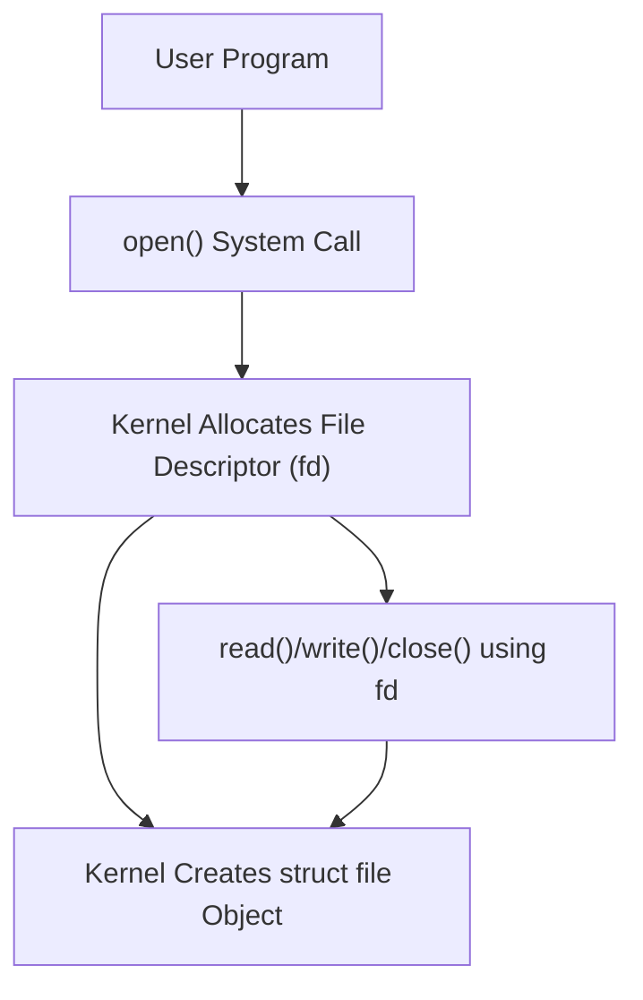
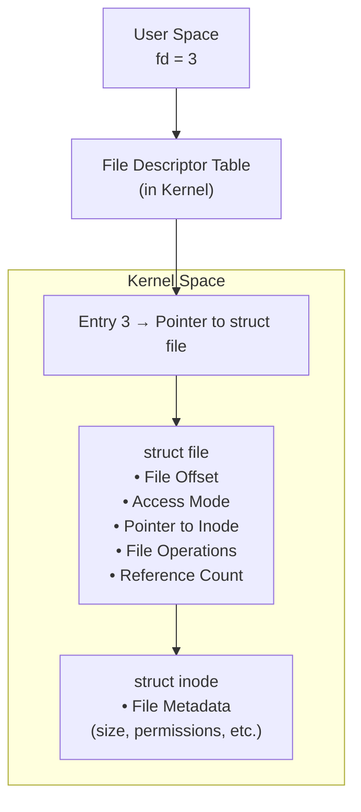
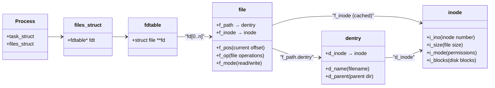

Almost everything in Linux—whether it's hardware devices, directories, or sockets—is treated as a **file**. The kernel provides a unified interface for file operations through **system calls** and the **Virtual File System (VFS)**.

These are the core syscalls used to manipulate files:

|Syscall|Description|
|---|---|
|`open()`|Opens/Creates a file, returns a **file descriptor (fd)**.|
|`close()`|Closes a file descriptor.|
|`read()`|Reads data from a file into a buffer.|
|`write()`|Writes data from a buffer to a file.|
|`lseek()`|Moves the file offset (for random access).|
|`stat()`|Gets file metadata (permissions, size, etc.).|
|`fcntl()`|Modifies file descriptor properties (non-blocking, locks, etc.).|
|`mmap()`|Maps a file into memory for fast I/O.|
|`fsync()`|Forces data to be written to disk.|


In Linux, every file has associated **permissions** that control who can access or modify it. These permissions are:

- **Read (`r`)** – Allows reading the contents of the file (**4 units**).
- **Write (`w`)** – Allows modifying or writing to the file (**2 units**).
- **Execute (`x`)** – Allows executing the file as a program or script (**1 unit**).

Each permission is represented by a specific value:

- Read = 4
- Write = 2
- Execute = 1

Permissions are assigned separately to **three categories of users**:

1. **User (Owner)** – The person who owns the file.
2. **Group** – A set of users in the same group as the file.
3. **Others** – All other users on the system.

**Types of Files**
- '-' : Regular File (Data Files)
- 'd' : Directory
- 'c' : Character Device File
- 'b' : Block Device File
- 's' : Local Socket File
- 'p' : Named Pipe
- 'l' : Symbolic Link


#### **File Descriptors (fd)**

Have you ever tried opening a file in Linux? If you have, you might have noticed that the system returns an integer value. But what exactly is this number? It’s called a **file descriptor**. In simple terms, a file descriptor is a unique identifier (an integer) assigned by the operating system to represent an opened file. You can think of it as a "descriptor" or handle to that file—an easy way for your program to refer to and interact with the file through various system calls like `read()`, `write()`, or `close()`.

- A **file descriptor** is an integer (`int`) representing an open file in a process. 
- This number is an **index into a kernel-managed table** (the **file descriptor table**) for your process. 
- It’s a **lightweight reference** to an actual file object in the kernel.
- Managed by the kernel in a **per-process file descriptor table**.
- Standard file descriptors: By default, three types of standard POSIX file descriptors exist in the file descriptor table, and you might already be familiar with them as data streams in Linux:
    - `0` → `stdin` (Standard Input)
    - `1` → `stdout` (Standard Output)
    - `2` → `stderr` (Standard Error)
- When you call `open()`, the kernel returns an integer (`int`), e.g., `4`.
- This number is an **index into a kernel-managed table** (the **file descriptor table**) for your process. 

> Info
{: .prompt-info }
> "In Linux, to perform any operation on a file—whether reading, writing, or manipulating its properties—you must first obtain a file descriptor."


**Process File Descriptor Table**

- Every process has a **private file descriptor table** (stored in `struct task_struct->files`).
- This table is an array of pointers to **`struct file`** objects (defined in `linux/fs.h`).

**View FDT**

We can use `/proc` to inspect open file descriptors for a process without directly accessing the File Descriptor Table (FDT), which is an internal kernel data structure.

For demonstration I used the following C program and put it into background.

```c
#include <stdio.h>
#include <fcntl.h>
#include <unistd.h>
int main() {
    char *s ="file.txt";
    int fd=open(s,O_CREAT,0644);
    getchar();
    close(fd);
}
```

```shell
$ ./a.out &
[2] 1794676
$ ls -l /proc/1794676/fd
total 0
lrwx------ 1 kali kali 64 Mar 31 14:41 0 -> /dev/pts/0
lrwx------ 1 kali kali 64 Mar 31 14:41 1 -> /dev/pts/0
lrwx------ 1 kali kali 64 Mar 31 14:41 2 -> /dev/pts/0
lr-x------ 1 kali kali 64 Mar 31 14:41 3 -> /tmp/sys/file.txt
```

When you call `open("test.txt", O_RDONLY)`, the kernel:

- **Creates a `struct file`** (represents the open file).
```c
struct file {
    struct path     f_path;      // Path to the file (dentry + vfsmount)
    struct inode    *f_inode;    // Pointer to inode (file metadata)
    const struct file_operations *f_op; // Functions (read, write, etc.)
    loff_t          f_pos;       // Current file offset (for read/write)
    atomic_long_t   f_count;     // Reference count
    // ... other fields ...
};
```
- **Stores it in the kernel’s global file table**.
- **Adds a pointer to this `struct file` in your process’s fd table** (e.g., at index `4`).


**The fd Number**

- The fd (`4`) is just an **index** in your process's fd table.    
- The kernel uses it to **look up the corresponding `struct file`**.

**`struct file`**

|Field|Description|
|---|---|
|`f_inode`|Pointer to the **inode** (file metadata: permissions, size, etc.).|
|`f_op`|**File operations** (function pointers for `read`, `write`, `mmap`, etc.).|
|`f_pos`|Current **read/write offset** (updated by `read()`, `write()`, `lseek()`).|
|`f_count`|**Reference count** (how many fds point to this `struct file`?).|

**How `fork()` affects File Descriptors**
- When you `fork()`, the child process gets a **copy of the parent’s fd table**.
- The `struct file` is **shared**, but the **fd numbers stay the same**.
- The kernel increments `f_count` to track references.




**What Happens on `close()`?**

1. The kernel **decrements `f_count`** in `struct file`.    
2. If `f_count` reaches `0`, the `struct file` is freed.
3. The fd slot is **marked as free** in the process’s fd table.


Check out [this](https://biriukov.dev/docs/fd-pipe-session-terminal/1-file-descriptor-and-open-file-description/) fantastic explanation by Biriukov—the author does an outstanding job breaking down file descriptors and open file descriptions in Linux with clarity and depth




I know—it can feel overwhelming at first. File operations, system calls, kernel structures—it's a lot to take in. But trust me, once we break it down step by step, you'll see how it all connects. We'll start from the very beginning—**opening a file**—and gradually dive deeper into **what really happens under the hood inside the kernel**.

At its core, **file operations** simply refer to actions you perform on files—opening, reading, writing, closing, etc.—but under system programming, these operations interact closely with the **operating system kernel**.


These operations are generally done using **system calls** like:

- `open()`
- `read()`
- `write()`
- `close()`    

Each of these system calls triggers kernel routines that manage file access, ensuring security, isolation, and efficiency.

When you open a file in Linux, several important kernel structures come into play to manage the file behind the scenes. First, every file on disk has an **inode**, which stores all its metadata such as file size, owner, permissions, timestamps, and pointers to the actual data blocks on disk—but it doesn’t store the file’s name. The filename itself is handled by a separate structure called the **dentry** (directory entry), which maps the file name to its inode and helps in fast path lookups during file access. When a file is opened, the kernel creates a file structure in memory, which represents the open file instance; this structure keeps track of the current file offset (where the next read or write will happen), access modes, and it points to the corresponding dentry and inode. Each process also has its own file descriptor table, which simply maps small integers (file descriptors like 3, 4, etc.) to these open file structures. So, when you open a file, the kernel resolves the file path using dentries and inodes, creates a file structure to represent the open file, and returns a file descriptor that your program uses for further operations. All these structures together ensure efficient file management, allowing the kernel to handle multiple open files, perform caching, and even support complex features like hard links and file deletion while still keeping files accessible if they’re open. 


An **inode** (**index node**) is a fundamental data structure used by filesystems to store **metadata** about a file or directory, _but not the file’s name or its actual content_.

Think of an inode as the **identity card** of a file—it describes **what the file _is_**, but doesn’t tell you _where_ to find it by name in the directory tree (that’s handled by **directory entries** or **dentries**).

Inodes **do not store the filename**.  
Filenames are stored in **directory entries** which map a name to an inode number.

This is why:

- Multiple filenames (hard links) can point to the **same inode** (same file content, same inode number).
- Deleting a file (removing its directory entry) only deletes its inode if the **link count** drops to zero.

In Linux, you can view inode numbers with:

```bash
ls -i
```

**NOTE**

Even "empty" files have inodes because every file must have metadata and at least zero-size allocation info.


## Opening a File - open()

The open() system call in UNIX-like operating systems is a fundamental function for handling files. It allows a program to open a file, creating a link between the file and a file descriptor, which is an integer representing the file within the program. This file descriptor is then used in subsequent read, write, and other file-related operations.

**Syntax**

```c
#include <fcntl.h>
int open(const char *pathname, int flags, mode_t mode);
```

1. pathname: This is the path to the file that you want to open. It can be an absolute path (like /home/user/file.txt) or a relative path (like file.txt).
2. flags: Flags that determine the file's access mode and behavior. Multiple flags can be combined using the bitwise OR (|) operator.
3. mode: The file permission mode if the file is being created. This parameter is only relevant when the O_CREAT flag is used. The mode parameter specifies the permissions for the newly created file. It is represented as an octal number, such as 0644.

The return value is a file descriptor, a non-negative integer, if successful. If the call fails, -1 is returned, and **errno** is set to indicate the error.

The flags argument controls how the file is opened. Commonly used flags include:

Access Modes (choose one):
- `O_RDONLY`: Open for reading only.
- `O_WRONLY`: Open for writing only.
- `O_RDWR`: Open for reading and writing.

File Creation and Status Flags (can be combined with bitwise OR):
- `O_CREAT`: Create the file if it doesn't exist.
- `O_EXCL`: Ensure that the `O_CREAT` flag creates the file; if the file already exists, the open call fails.
- `O_TRUNC`: Truncate the file to zero length if it already exists and is opened for writing.
- `O_APPEND`: Write operations will append data to the end of the file.

In Linux/C programming, `errno` is a global integer variable set by system calls and library functions to indicate errors.

Use `errno -l` to look up errno names and descriptions.


`perror()` can also be used to print `errno`:

```c
//..
	perror("[-]");
//
```

After finishing with the file, it's important to close it using the `close` system call to free up system resources.

File descriptors are inherited by child processes created with `fork()`. If you don't want a file descriptor to be inherited, you can use the `O_CLOEXEC` flag when opening the file, or set the `FD_CLOEXEC` flag using fcntl().

```c
#include <fcntl.h>
#include <stdio.h>
#include <unistd.h>
#include <string.h>
#include <errno.h>

int main() {
    const char *filename = "example.txt";
    
    // Open the file for writing. Create it if it doesn't exist, truncate it to zero length if it does, and set permissions to 0644
    int fd = open(filename, O_WRONLY | O_CREAT | O_TRUNC, 0644);

    if (fd == -1) {
        // perror("Error opening file");
		// Print an error message with errno
		fprintf(stderr, "Error opening file: %s\n", strerror(errno));
        return 1;
    }

    // Close the file
    if (close(fd) == -1) {
        perror("Error closing file");
        return 1;
    }

    printf("File opened successfully.\n");

    return 0;
}
```


To list the file descriptors (FDs) opened by a process with a specific PID (e.g., 123), you can use several methods on a Linux system:

- Using the `/proc` Filesystem
The /proc filesystem provides a directory for each process, containing information about the process. The file descriptors are listed under the `fd` directory inside the process's directory.

```bash
# ls -l /proc/[PID]/fd
ls -l /proc/123/fd
```

This command will list all file descriptors opened by the process with PID 123. The output will show the file descriptor numbers and the files or sockets they point to.

- Using `lsof`

The lsof (list open files) command can be used to display all open files by processes, including the file descriptors.
```bash
lsof -p PID
```

- Using `/proc/PID/fdinfo/fd`

The `/proc/[PID]/fdinfo/[FD]` files give more detailed information about specific file descriptors.

```bash
cat /proc/PID/fdinfo/3
```

File descriptors themselves are entries in the file descriptor table (`fdtable`) of the process, which is part of the `files_struct`. While these aren't directly visible in the process's memory map (like a specific memory region), they are accessible via structures managed by the kernel.




1. **Process → `files_struct`**
    
    - Every process has a `files_struct` (in `task_struct`), which holds the **file descriptor table**.
        
2. **`files_struct` → `fdtable`**
    
    - The `fdtable` contains an array (`fd[]`) of pointers to `struct file` objects.
        
3. **`fdtable` → `file`**
    
    - Each file descriptor (`fd`) is an index into this array, pointing to a `struct file`.
        
4. **`file` → `dentry` and `inode`**
    
    - The `struct file` links to:
        - A `dentry` (directory entry) for pathname resolution.
        - An `inode` (file metadata).
    
    - Note: The `file->f_inode` is a **cached copy** of `dentry->d_inode`.
        
5. **`dentry` → `inode`**
    
    - The `dentry` (filename cache) points to the actual `inode` on disk.


To add permission:

```c
int fd=	open(file,O_CREAT|O_TRUNC,0555); //r-xr-xr-x
```

But the above code fails when we try to assing `0777` perm.
This issue arises due the system's umask value.

**Understanding umask**

When a file is created, the operating system applies a set of default permissions known as the umask. The umask value acts as a mask to the permissions requested when creating a file, removing certain permissions.
The umask (UNIX shorthand for "user file-creation mode mask") is a four-digit octal number that UNIX uses to determine the file permission for newly created files. Every process has its own umask, inherited from its parent process.

You can print the umask value by using `umask` command.
On many UNIX systems, the default umask is 022. This is inherited from the init process, as all processes are descendants of init.


The default umask value on most systems is often 022, which means:
-  Read, write, and execute for the owner (user): rwx
-  Read and execute for the group: r-x
-  Read and execute for others: r-x


**How umask Affects File Creation**

When you create a file with `open(file, O_CREAT | O_TRUNC, 0777);`, the requested permissions are rwxrwxrwx (777). However, the system applies the umask value to this request before creating the file. It effectively "masks off" the permissions specified by the umask.

In your case, with a default umask of 022:
- The requested permissions: rwxrwxrwx (777)
- The umask: 022
- Applied permissions: rwxr-xr-x (755) which is 777 ^ 022


**Modifying the umask**

If you want to create a file with rwxrwxrwx (777) permissions regardless of the system's umask, you can modify the umask temporarily using the `umask()` function before calling open(). 

```c
	// Store the current umask
    mode_t old_mask = umask(0);
    printf("%03o\n",old_mask); //print old umask


    // Create the file with 0777 permissions
    int fd = open(file, O_CREAT | O_TRUNC, 0777);
    if (fd == -1) {
        perror("Error opening file");
        return 1;
    }

    // Restore the original umask
    umask(old_mask);
```

**NOTE:**

`umask()`  sets  the calling process's file mode creation mask (umask) to mask & 0777 (i.e., only the file permission bits of mask are used), and returns the previous value of the mask.


## Reading a File - read()

In UNIX System Programming, the read() function is used to read data from an open file descriptor. It is particularly useful for reading from regular files, pipes, and other types of file descriptors. Here's an overview of how to use read() to read data from a file:

```c
// Syntax:
#include <unistd.h>
ssize_t read(int fd, void *buf, size_t size);
```

- fd: File descriptor of the open file from which to read.
- buf: Pointer to a buffer where the data read will be stored.
- size: Maximum number of bytes to read.
	
Return Value:
- -1: Indicates an error occurred.
- 0: Indicates the end of the file (EOF) has been reached.
- Positive integer: Number of bytes actually read.


After opening the file, we can use `read()` to read data into a buffer.

```c
#include <unistd.h>
#define BUFFER_SIZE 1024
char buffer[BUFFER_SIZE];

ssize_t bytes_read = read(fd, buffer, BUFFER_SIZE);
if (bytes_read == -1) {
    // Handle read error
} else if (bytes_read == 0) {
    // End of file
} else {
    // Process the data read
}
```

If read() returns -1, an error occurred during reading. The errno variable can be checked to determine the specific error.

If read() returns 0, it indicates that the end of the file (EOF) has been reached. This is not an error; it just means there is no more data to read.

Otherwise, `bytes_read` contains the number of bytes read successfully. This data can be processed as needed.


Once finished reading from the file, it's good practice to close it using the close() function.

```c
close(fd);
```

*Example*

```c
#include <stdio.h>
#include <stdlib.h>
#include <fcntl.h>
#include <unistd.h>
#include <errno.h>

int main() {
    const char *filename = "example.txt";
    const int BUFFER_SIZE = 1024;
    char buffer[BUFFER_SIZE];
    
    // Open the file for reading
    int fd = open(filename, O_RDONLY);
    if (fd == -1) {
        perror("Error opening file");
        return 1;
    }

    // Read from the file
    ssize_t bytes_read = read(fd, buffer, BUFFER_SIZE);
    if (bytes_read == -1) {
        perror("Error reading from file");
        close(fd);
        return 1;
    } else if (bytes_read == 0) {
        printf("End of file reached.\n");
    } else {
        // Null-terminate the buffer to treat as a string
        buffer[bytes_read] = '\0';
        printf("Data read from file:\n%s\n", buffer);
    }

    // Close the file
    close(fd);
    
    return 0;
}

```

**NOTE**

read() does not allocate any memory, user must allocate memory and pass to read().

## Writing to a File - write()

In UNIX System Programming, the write() function is used to write data to an open file descriptor. It allows programs to write data to files, sockets, pipes, and other types of file descriptors. 

```c
#include <unistd.h>

ssize_t write(int fd, const void *buf, size_t count);
```
-  fd: File descriptor of the open file where data will be written.
-  buf: Pointer to the buffer containing the data to write.
-  count: Number of bytes to write from the buffer.
	
	
**Return Value:**

- -1: Indicates an error occurred.
- Non-negative integer: Number of bytes actually written.


After opening the file, we can use write() to write data from a buffer into the file.

```c
#include <unistd.h>
char *data = "Hello, world!\n";
ssize_t bytes_written = write(fd, data, strlen(data));
if (bytes_written == -1) {
    // Handle write error
} else {
    // Data written successfully
}
```
*Example*

```c
#include <stdio.h>
#include <stdlib.h>
#include <fcntl.h>
#include <unistd.h>
#include <errno.h>
#include <string.h>

int main() {
    const char *filename = "example.txt";
    const char *data = "Hello, world!\n";
    
    // Open the file for writing (create if it doesn't exist)
    int fd = open(filename, O_WRONLY | O_CREAT, 0644);
    if (fd == -1) {
        perror("Error opening file");
        return 1;
    }

    // Write data to the file
    ssize_t bytes_written = write(fd, data, strlen(data));
    if (bytes_written == -1) {
        perror("Error writing to file");
        close(fd);
        return 1;
    }

    // Close the file
    close(fd);
    
    return 0;
}

```

## File lseek()

In UNIX System Programming, the `lseek()` function is used to move the file offset associated with an open file descriptor. It allows programs to seek to a specific position within a file for reading or writing. 

A file can be considered as a continuous set of bytes. There is a internal indicator present, which points to the offset byte of the file. The offset is used to read/write the next set of bytes/data from file. This indicator is updated when we do any file operation like read() or write().
lseek is a system call that is used to change the location of the read/write pointer of a file descriptor. The location can be set either in absolute or relative terms.

Here's an overview of `lseek()`:

**Syntax:**
```c
#include <unistd.h>

off_t lseek(int fd, off_t offset, int whence);
```

- `fd`: File descriptor of the open file whose offset will be manipulated.
- `offset`: Number of bytes to move the file pointer.
- `whence`: Specifies the reference point for the offset:
  - `SEEK_SET`: Offset is set to offset bytes from the beginning of the file.
  - `SEEK_CUR`: Offset is set to its current location plus offset.
  - `SEEK_END`: Offset is set to the end of the file plus offset.

**Return Value:**
- -1: Indicates an error occurred.
- New file offset: Returns the new offset from the beginning of the file.

Following example will clear it.

```bash
$ cat example.txt
Hello, world!
```

*Example*

```c
#include <stdio.h>
#include <stdlib.h>
#include <fcntl.h>
#include <unistd.h>
#include <errno.h>
#include <string.h>

int main() {
    const char *filename = "example.txt";
    
    // Open the file for reading and writing (must exist)
    int fd = open(filename, O_RDWR);
    if (fd == -1) {
        perror("Error opening file");
        return 1;
    }

    // Move the file offset 7 bytes from the beginning
    off_t offset = lseek(fd, 7, SEEK_SET);
    if (offset == -1) {
        perror("Error using lseek");
        close(fd);
        return 1;
    }

    // Write new data starting from the new offset
    const char *new_data = "Linux";
    ssize_t bytes_written = write(fd, new_data, strlen(new_data));
    if (bytes_written == -1) {
        perror("Error writing to file");
        close(fd);
        return 1;
    }

    printf("Wrote '%s' at offset %ld\n", new_data, offset);

    // Close the file
    close(fd);
    return 0;
}

```

```bash
$ gcc lseek_demo.c  -o lseek_demo
$ tmp  cat example.txt 
Hello, world!
$ ./lseek_demo 
Wrote 'Linux' at offset 7
$ cat example.txt 
Hello, Linux!
```

You can get the new offset by again calling `lseek()`

```c
    // Get the new file offset after writing
    off_t new_offset = lseek(fd, 0, SEEK_CUR);
    if (new_offset == -1) {
        perror("Error getting current file offset");
        close(fd);
        return 1;
    }
    
    printf("Current file offset after writing: %ld\n", new_offset);

```

If you don’t know the **position of the word `"world"`** in advance, you’ll first need to **search for it inside the file**, locate the word’s position, and then use `lseek()` to move to that position.

```c
#include <stdio.h>
#include <stdlib.h>
#include <fcntl.h>
#include <unistd.h>
#include <errno.h>
#include <string.h>

int main() {
    const char *filename = "example.txt";
    const char *target_word = "world";
    const char *new_word = "Linux";
    char buffer[1024];  // Adjust size as needed

    // Open file for reading and writing
    int fd = open(filename, O_RDWR);
    if (fd == -1) {
        perror("Error opening file");
        return 1;
    }

    // Read file content into buffer
    ssize_t bytes_read = read(fd, buffer, sizeof(buffer) - 1);
    if (bytes_read == -1) {
        perror("Error reading file");
        close(fd);
        return 1;
    }

    buffer[bytes_read] = '\0';  // Null-terminate for safe string handling

    // Find the position of target word
    char *pos = strstr(buffer, target_word);
    if (pos == NULL) {
        printf("Word '%s' not found in file.\n", target_word);
        close(fd);
        return 0;
    }

    off_t offset = pos - buffer;  // Calculate position of the word
    printf("Found word '%s' at offset %ld\n", target_word, offset);

    // Seek to the position of the word
    if (lseek(fd, offset, SEEK_SET) == -1) {
        perror("Error seeking in file");
        close(fd);
        return 1;
    }

    // Overwrite with new word (ensure length fits!)
    if (write(fd, new_word, strlen(new_word)) == -1) {
        perror("Error writing new word");
        close(fd);
        return 1;
    }

    printf("Replaced '%s' with '%s' at offset %ld\n", target_word, new_word, offset);

    close(fd);
    return 0;
}
```

