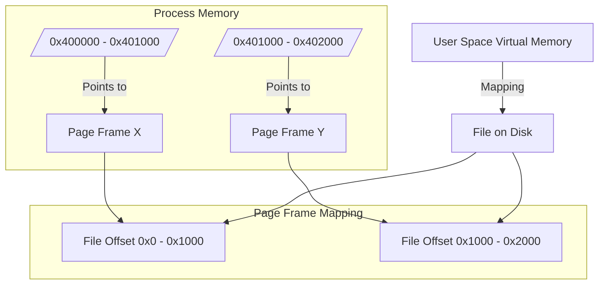

When a program executes, it requires memory to store data, variables, and control structures. In Linux, memory allocation can broadly be categorized into two types: static and dynamic. Each serves different needs and has its own advantages and limitations.

1. Static Memory Allocation: Memory is allocated at compile time. The size of the data must be known beforehand, and it cannot change during program execution.
2. Dynamic Memory Allocation: Memory is allocated during runtime using specific functions, allowing for more flexible memory management.


### Dynamic Memory Allocation

**Dynamic memory allocation** refers to the process of allocating memory **at runtime**, rather than at compile time. This means the program requests memory from the operating system while it is running, allowing it to adjust memory usage based on actual conditions or inputs.

In C (and system-level programming on Linux), dynamic memory is typically managed using functions provided by the standard library, such as:

- `malloc()` – allocates a specified number of bytes
- `calloc()` – allocates and initializes memory
- `realloc()` – resizes previously allocated memory
- `free()` – releases allocated memory back to the system

1. `malloc(size_t size)`: Allocates a block of memory of specified size and returns a pointer to the first byte. The memory is uninitialized.

```c
int *arr = (int *)malloc(10 * sizeof(int));
if (arr == NULL) {
    // Handle allocation failure
}
```

2. `calloc(size_t num, size_t size)`: Allocates memory for an array of num elements, each of size bytes, and initializes all bytes to zero.

```c
int *arr = (int *)calloc(10, sizeof(int));
if (arr == NULL) {
    // Handle allocation failure
}
```

3. `realloc(void *ptr, size_t new_size)`: Resizes the memory block pointed to by ptr to new_size. If the new size is larger, it may allocate a new block and copy the old data to it.

```c
arr = (int *)realloc(arr, 20 * sizeof(int));
if (arr == NULL) {
    // Handle allocation failure
}
```

4. `free(void *ptr)`: Deallocates the memory previously allocated by malloc, calloc, or realloc. It is essential to free dynamically allocated memory to prevent memory leaks.

```c
free(arr);
```

*Example*

```c
#include <stdio.h>
#include <stdlib.h>
#include <string.h>

int main() {
    int n = 10;
    // Allocate memory for n integers
    int *arr = (int *)malloc(n * sizeof(int));
    if (arr == NULL) {
        printf("Memory allocation failed\n");
        return 1; // Exit if allocation fails
    }

    // Initialize allocated memory to zero
    memset(arr, 0, n * sizeof(int));

    // Print the initialized array
    for (int i = 0; i < n; i++) {
        printf("%x ", arr[i]);
    }
    printf("\n");

    // Free allocated memory
    free(arr);
    return 0;
}
```

In this example, memory is dynamically allocated for an array of integers using `malloc()`, and then initialized using `memset()`. 


> Info
{: .prompt-info }
memset sets **bytes**, not integers.

**What malloc Does**

malloc allocates a specified number of bytes in memory and returns a pointer to the beginning of that block. The allocated memory is uninitialized, meaning it contains garbage values until explicitly set by the program

### System Calls used by `malloc()`

Before this we need to know some significant terms that will be used throughout the post:
- start_brk: pointer which denotes the beginning of the heap segment.
- brk: pointer that denotes the end of the heap segment.
- end_data: pointer which sets the end of the data segment.

The `malloc()` function is part of the C standard library (`libc`), but it internally relies on lower-level **system calls** provided by the Linux kernel to obtain memory from the operating system. Depending on the size of the allocation and the implementation of `malloc()`, it may use one or both of the following system calls:

- **`brk()` / `sbrk()`**
    
    - These system calls adjust the end of the process's data segment (also called the **heap**).
    - Suitable for small to medium allocations.
    - `brk()` sets the end of the heap; `sbrk()` increments it.
    - Deprecated in modern systems and rarely used directly.
        
- **`mmap()`**
    
    - Maps pages of memory into the process’s address space.
    - Commonly used by `malloc()` for large memory allocations (e.g., >128 KB in `glibc`).
    - Offers more control and is better suited for non-contiguous memory blocks.
    - Memory allocated with `mmap()` is automatically page-aligned.


We can use `strace` to observe the underlying system calls made by `malloc()` during program execution.

## Process Creation and Termination in C

In C programming, particularly within UNIX-like operating systems, process creation and termination are fundamental concepts managed through system calls like fork(), exec(), wait(), and exit() system calls.

### Process Creation

The primary method for creating a new process in C is through the fork() system call. When invoked, fork() creates a new process known as the child process, which is an exact duplicate of the calling process, referred to as the parent process.

The syntax for fork() is as follows:
```c
#include <unistd.h>
pid_t fork(void);
```

Return Values:
- Returns a negative value if the creation of the child process fails.
- Returns 0 to the child process.
- Returns the process ID (PID) of the newly created child to the parent process.

After calling fork(), both processes (parent and child) will execute concurrently from the point of the fork, each with its own copy of the program's data.

```c
#include <stdio.h>
#include <unistd.h>

int main() {
    pid_t pid = fork();
    
    if (pid < 0) {
        // Fork failed
        perror("Fork failed");
        return 1;
    } else if (pid == 0) {
        // This block is executed by the child
        printf("Child process: PID = %d\n", getpid());
    } else {
        // This block is executed by the parent
        printf("Parent process: PID = %d, Child PID = %d\n", getpid(), pid);
    }
    return 0;
}
```

### Process Execution
Once a child process is created using fork(), it can execute a different program using the exec() family of functions. The most common form is execl(), which overlays the current process image with a new program.

```c
#include <stdio.h>
#include <unistd.h>

int main() {
    pid_t pid = fork();
    
    if (pid == 0) {
        // Child process executes a different program
        execl("/bin/ls", "ls", NULL);
        perror("execl failed"); // Only reached if exec fails
    }
    return 0;
}
```


### Process Termination
Processes can terminate in two main ways:
1. Normal Termination:
This can be done using:
- exit(int status): Cleans up and terminates the calling process.
- _exit(int status): Terminates immediately without cleaning up.

2. Abnormal Termination:
This occurs when a signal is sent to terminate a process, such as SIGTERM.


```c
#include <stdlib.h>
#include <stdio.h>

void cleanup() {
    printf("Cleanup function called.\n");
}

int main() {
    atexit(cleanup); // Register cleanup function
    printf("Program is exiting normally.\n");
    exit(0); // Normal exit
}
```


**Synchronization Between Parent and Child**
To manage synchronization between parent and child processes, especially to ensure that resources are properly cleaned up, the parent can use wait() or waitpid() to wait for the child process to finish executing.

```c
#include <stdio.h>
#include <stdlib.h>
#include <sys/types.h>
#include <sys/wait.h>
#include <unistd.h>

int main() {
    pid_t pid = fork();
    
    if (pid == 0) {
        // Child process
        printf("Child process running...\n");
        sleep(2); // Simulate work
        exit(42); // Exit with status code 42
    } else {
        // Parent process waits for child to finish
        int status;
        wait(&status);
        printf("Child exited with status %d\n", WEXITSTATUS(status));
    }
    return 0;
}
```

### **mmap Internals**

`mmap` is a system call that **maps files or devices into memory**. It can be used to:

- Map a file into memory (shared or private) 
- Allocate anonymous memory (like `malloc`, but page-aligned and kernel-backed)
- Map device memory
- Implement memory-mapped I/O

In C (glibc wrapper):

```c
void *mmap(void *addr, size_t length, int prot, int flags, int fd, off_t offset);
```
- `addr`: Desired address (can be `NULL`)  
- `length`: Size of the mapping
- `prot`: `PROT_READ`, `PROT_WRITE`, etc.
- `flags`: `MAP_PRIVATE`, `MAP_SHARED`, `MAP_ANONYMOUS`, etc.
- `fd`: File descriptor (can be `-1` for anonymous mapping)
- `offset`: Offset in the file/device to start mapping


### Kernel Internals (Linux)


1. `sys_mmap` → `do_mmap`

In the kernel, the syscall ends up in:

```c
SYSCALL_DEFINE6(mmap, ...)
```

This calls `vm_mmap_pgoff()`, which does:

```c
vm_mmap_pgoff(struct file *file, unsigned long addr,
              unsigned long len, unsigned long prot,
              unsigned long flags, unsigned long pgoff)
```

That in turn calls `do_mmap()` (actual heavy-lifting happens here).

2. `do_mmap()`: Core of the mmap engine

```c
unsigned long do_mmap(struct file *file, unsigned long addr,
                      unsigned long len, unsigned long prot,
                      unsigned long flags, unsigned long pgoff,
                      unsigned long *populate)
```

### Page Faults and Lazy Allocation

- `mmap()` just sets up the VMA. 
- Pages are **not actually allocated** until accessed.
- When accessed, a **page fault** triggers:
    - Kernel looks up the VMA
    - Allocates a page (if anonymous)
    - Or loads file-backed page from disk (via `readpage`, etc.)
    - Installs a **PTE** (Page Table Entry)
    
This is **demand paging**.


### Anonymous vs File-backed

**Anonymous Mapping (`MAP_ANONYMOUS`)**

- Not backed by any file
- Used like a big `malloc`
- Pages are zero-filled on first access
- Example: stacks, heaps, malloc()

**File-backed Mapping**

- Maps a file directly into memory
- Pages loaded from disk
- Modified pages are flushed back if `MAP_SHARED`
- Common in databases, shared memory apps, etc.


#### `mmap` Use-cases

- ELF loading (exec calls mmap to load binary + segments)
- Shared memory between processes
- Memory-mapped I/O with devices
- File editing without I/O syscalls
- Fast memory allocators
- Sandboxing techniques

When `munmap()` is called:

- VMA is removed from `mm_struct->mmap`
- Page table entries are removed
- Pages are freed or flushed (if dirty)
- Associated file descriptors aren’t closed, just unmapped

#### What is _Mapping_ in `mmap`?

Imagine you have a file on disk. Instead of reading it with `read()`, `mmap` gives you a pointer to memory that directly corresponds to the file’s contents. This memory can then be used like a normal array.


**Mapping a File into Memory**



- `mmap()` reserves a virtual memory range (like `0x400000 - 0x402000`) in your process.
- It maps this range to two **page frames** in physical memory.
- Those pages are filled with data from a file on disk (`offset 0x0` and `0x1000`).
- You can now access file data **as if it were a regular array** in memory.

```c
#include <stdio.h>
#include <sys/mman.h>
#include <fcntl.h>
#include <string.h>
#include <unistd.h>
#include <stdlib.h>

int main() {
    int fd = open("file.txt", O_RDWR | O_CREAT, 0666);
    if (fd < 0) {
        perror("open");
        exit(1);
    }

    char *s = "AAAA";
    int len = strlen(s);

    // ⚠️ Ensure the file is at least 'len' bytes
    if (ftruncate(fd, len) == -1) {
        perror("ftruncate");
        close(fd);
        exit(1);
    }

    void *ptr = mmap(NULL, len, PROT_READ | PROT_WRITE, MAP_SHARED, fd, 0);
    if (ptr == MAP_FAILED) {
        perror("mmap");
        close(fd);
        exit(1);
    }

    memcpy(ptr, s, len);

    munmap(ptr, len);
    close(fd);

    return 0;
}

```

