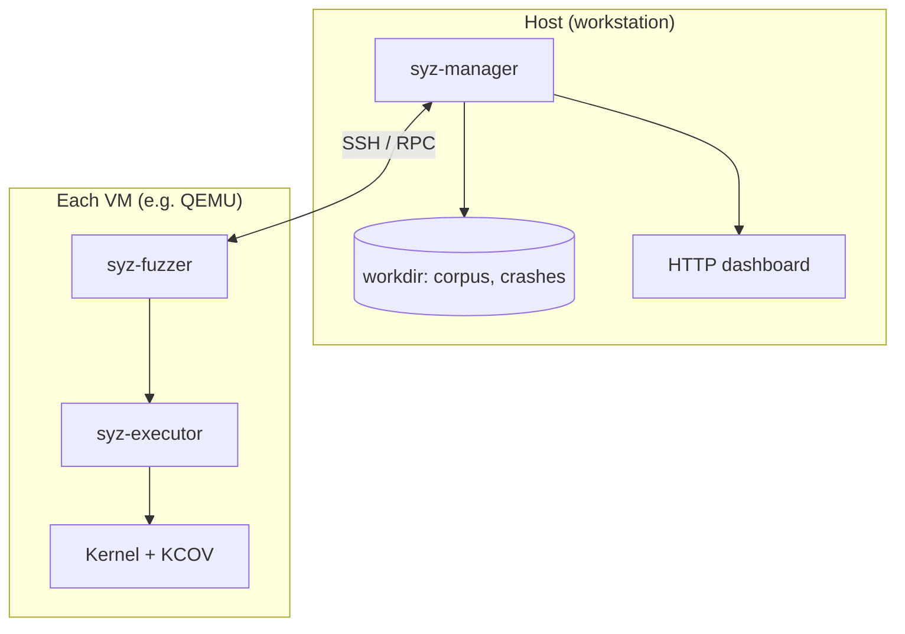

Fuzzing matters for OS security. **Syzkaller** is Google's coverage-guided kernel fuzzer (powers **syzbot** too). It does not poke a single userspace binary: it generates syscall **programs** in a small language called **syzlang**, runs them in **VMs**, and uses **KCOV** so the kernel reports which edges executed. Programs that find new coverage get kept and mutated.

This post is **Part 1**: how the pieces fit, what to install, and how to build a kernel that is actually useful to fuzz. **Part 2** adds a toy buggy driver, syzlang for it, manager configs, and the crash/repro story. [Continue to Part 2]() when you want that.


---

## Why the kernel is awkward to fuzz

Userspace fuzzers (AFL, libFuzzer) run in one process and call your code directly. The kernel does not hand you `LLVMFuzzerTestOneInput`. You need:

- A kernel built with **KCOV** (and usually **KASAN** or similar).
- VMs (I use **QEMU**) so a panic does not kill your host.
- A syscall description layer: **syzlang** lives in `sys/linux/*.txt` inside the syzkaller repo.

More moving parts than fuzzing a parser, but you hit real entry points: syscalls, ioctls, netlink, the messy stuff.


---

## How it fits together

The usual mental model matches what [Andre Almeida described at Collabora](https://www.collabora.com/news-and-blog/blog/2020/03/26/syzkaller-fuzzing-the-kernel/): **manager software on the host** runs the show; it **spawns VMs** with **fuzzers inside** that generate and run syscall programs; those guests **talk back over RPC** (programs, coverage, traces, crashes); the manager **stores state** (corpus, DB) and exposes a **web UI**. Physical machines are supported too, but VMs keep panics off your laptop.

**Credit:** The host / VM / RPC / storage breakdown follows Collabora’s [Using syzkaller, part 1: Fuzzing the Linux kernel](https://www.collabora.com/news-and-blog/blog/2020/03/26/syzkaller-fuzzing-the-kernel/) (March 2020). That article also introduces **syzlang** with `open` and `ioctl` examples; use it next to the official [syscall descriptions](https://github.com/google/syzkaller/blob/master/docs/syscall_descriptions.md) doc.

| Piece | Role |
|------|------|
| `syz-manager` | On the **host**: starts VMs, hands out work, merges coverage, writes crashes, **HTTP** UI. |
| `syz-fuzzer` | In each **guest**: RPC to manager, receives programs, drives the executor. |
| `syz-executor` | In the guest: runs one syscall program (sandbox, KCOV). |
| VM backend | QEMU + image with **sshd**, root key, **debugfs** for KCOV. |
| Kernel under test | KCOV + optional KASAN, fault injection, … |
| Workdir | On the host: `corpus.db`, crash dirs, seeds. |

Loop in one sentence: the manager pushes a program into a VM, the executor runs it against the kernel, new coverage is kept and mutated; on an oops the manager saves logs and may later run `syz-repro` with the same JSON and a crash log.




---

## What I actually ran (so you can compare)

| Item | What I used |
|------|-------------|
| Host | Linux (Kali rolling), amd64 |
| Sources | **Linux 6.19** from the upstream tarball, `defconfig` + `kvm_guest.config` |
| Syzkaller | Upstream git, **Go 1.23+** per their docs |
| Disk image | Debian **Trixie**-style image from `tools/create-image.sh` (`trixie.img` + key) |
| Hypervisor | QEMU with KVM when `/dev/kvm` exists |

Paths on your machine will differ. Keep mental aliases for syzkaller checkout, kernel tree, and image.

---

## Host packages

You will want: **Go** (1.23+), **GCC** (docs say 6+ for KCOV), **QEMU** for x86_64, kernel build deps (**make**, **flex**, **bison**, **libssl-dev**, **libelf-dev**, ncurses dev package). Add yourself to the **kvm** group if QEMU complains about KVM.

Clone and build:

```bash
git clone https://github.com/google/syzkaller.git
cd syzkaller
make
```

Outputs land in `bin/` (`syz-manager`, `syz-repro`, `syz-execprog`, per-arch `syz-executor`, ...). Upstream likes `tools/syz-env` for reproducible builds; on a normal distro `make` alone often works.

---

## Kernel config that does not waste your time

Plain `defconfig` is not enough. Turn on at least:

- `CONFIG_KCOV=y` so the kernel can report coverage.
- `CONFIG_KCOV_INSTRUMENT_ALL=y` and `CONFIG_KCOV_ENABLE_COMPARISONS=y` if you want decent signal.
- `CONFIG_DEBUG_FS=y` (KCOV hangs off debugfs).
- `CONFIG_KASAN=y` and `CONFIG_KASAN_INLINE=y` for memory bug reports most people can read.
- `CONFIG_DEBUG_INFO_DWARF_TOOLCHAIN_DEFAULT=y` or whatever your tree uses for debug info.
- `CONFIG_CONFIGFS_FS=y` and `CONFIG_SECURITYFS=y` (images from `create-image.sh` expect them).
- Run `make kvm_guest.config` once so virtio and guest-ish defaults are sane.

The full shopping list is in `docs/linux/kernel_configs.md`. syzbot's huge reference configs live under `dashboard/config/linux/`; for learning I merged a small fragment on top of `defconfig` instead of diffing a 5000-line file.

### Example `syzkaller.fragment`

Put a file of `CONFIG_*=y` (and string) lines anywhere you like; the merge script applies it on top of your current `.config`. Below is the fragment I used with Linux 6.19. **`CONFIG_DVKM=y` is only valid after you add the demo driver from [Part 2]()** (Kconfig + sources). For Part 1 alone, delete that line or comment it out so `olddefconfig` does not depend on a symbol your tree does not ship.

```text
# Syzkaller-oriented options (see syzkaller docs/linux/kernel_configs.md)
# Merged on top of defconfig + kvm_guest.config

# Coverage
CONFIG_KCOV=y
CONFIG_KCOV_INSTRUMENT_ALL=y
CONFIG_KCOV_ENABLE_COMPARISONS=y
CONFIG_DEBUG_FS=y

# Debug info for symbolization (Linux >= 5.12)
CONFIG_DEBUG_INFO_DWARF_TOOLCHAIN_DEFAULT=y

CONFIG_KALLSYMS=y
CONFIG_KALLSYMS_ALL=y

# Namespaces / sandboxing
CONFIG_NAMESPACES=y
CONFIG_UTS_NS=y
CONFIG_IPC_NS=y
CONFIG_PID_NS=y
CONFIG_NET_NS=y
CONFIG_CGROUP_PIDS=y
CONFIG_MEMCG=y
CONFIG_USER_NS=y

# VM image helpers (create-image.sh / Debian)
CONFIG_CONFIGFS_FS=y
CONFIG_SECURITYFS=y

# KASAN
CONFIG_KASAN=y
CONFIG_KASAN_INLINE=y

# Fault injection (syzkaller uses these when available)
CONFIG_FAULT_INJECTION=y
CONFIG_FAULT_INJECTION_DEBUG_FS=y
CONFIG_FAULT_INJECTION_USERCOPY=y
CONFIG_FAILSLAB=y
CONFIG_FAIL_PAGE_ALLOC=y
CONFIG_FAIL_MAKE_REQUEST=y
CONFIG_FAIL_IO_TIMEOUT=y
CONFIG_FAIL_FUTEX=y

# Predictable interface names off (optional but recommended)
CONFIG_CMDLINE_BOOL=y
CONFIG_CMDLINE="net.ifnames=0"

# Part 2 only: Damn Vulnerable Kernel Module (/dev/dvkm). Omit until that driver exists in your tree.
CONFIG_DVKM=y
```


Sequence I used for x86_64:

```bash
cd /path/to/linux-6.19
make defconfig
make kvm_guest.config
./scripts/kconfig/merge_config.sh -m .config /path/to/syzkaller.fragment
make olddefconfig
make -j"$(nproc)"
```

What you boot: **`arch/x86/boot/bzImage`**. What you keep for symbolization: **`vmlinux`** at the tree root.

If merge_config complains, run `make olddefconfig` again after editing the fragment.

---

## You still need a rootfs

Syzkaller fuzzes a **machine**, not a kernel file in a vacuum. The image must boot your `bzImage`, start **sshd**, accept **root** with the key you put in the manager config, and mount **debugfs** at `/sys/kernel/debug`. The script `tools/create-image.sh` (Debian-based) does the boring work; you end up with something like `trixie.img` and a matching `*.id_rsa`.

---

## Manager JSON (minimal shape)

`syz-manager` wants real JSON (no `//` comments). Fields you will touch constantly:

- `target`: e.g. `"linux/amd64"`
- `workdir`: corpus + crashes
- `kernel_obj`: build tree (finds `vmlinux`)
- `image`: raw disk path
- `sshkey`: private key, mode `0600`
- `syzkaller`: checkout path (it finds `bin/` under there)
- `type`: `qemu`
- `vm`: `kernel` (path to `bzImage`), `count`, `cpu`, `mem`

Example skeleton:

```json
{
  "target": "linux/amd64",
  "http": "127.0.0.1:56741",
  "workdir": "/path/to/workdir",
  "kernel_obj": "/path/to/linux-6.19",
  "image": "/path/to/trixie.img",
  "sshkey": "/path/to/trixie.id_rsa",
  "syzkaller": "/path/to/syzkaller",
  "procs": 4,
  "type": "qemu",
  "vm": {
    "count": 2,
    "cpu": 2,
    "mem": 2048,
    "kernel": "/path/to/linux-6.19/arch/x86/boot/bzImage"
  }
}
```

Run:

```bash
./bin/syz-manager -config /path/to/manager.cfg
```

Hit the `http` URL: exec rate, coverage, crashes.

---

## syzlang (one paragraph)

Everything the fuzzer knows about `open`, `ioctl`, sockets, etc. comes from `sys/linux/*.txt`. `syz-sysgen` compiles those into what lives in the binaries. Add a custom driver in Part 2 and you add another `.txt` and run `make descriptions`. That is the whole trick.

---

## When something breaks


- QEMU/KVM weirdness: trim `qemu_args` to `-enable-kvm` or turn KVM off (slower but boring).
- SSH: key permissions, sshd not up, hostfwd port wrong.
- `unknown enabled syscall`: the name is not in the syscall table you built. Run `make descriptions` and rebuild after editing `sys/linux/*.txt`.
- First boot spams "disabled syscall" lines: normal. The fuzzer probes the guest and turns off what the kernel does not implement.

---

## Next post

Part 2 plugs in a small misc device at `/dev/dvkm`, adds `dev_dvkm.txt`, shows narrow `enable_syscalls` configs for demos, and walks through `workdir/crashes/` plus `syz-repro` on a `log0` file.

**[Part 2: Damn vulnerable module + demo pipeline]()**

---

## References

- [Collabora: Using syzkaller, part 1: Fuzzing the Linux kernel](https://www.collabora.com/news-and-blog/blog/2020/03/26/syzkaller-fuzzing-the-kernel/) (Andre Almeida, 2020). Architecture overview and syzlang intro; cited above for the host/VM/RPC diagram.
- [Syzkaller setup](https://github.com/google/syzkaller/blob/master/docs/setup.md)
- [Kernel configs for fuzzing](https://github.com/google/syzkaller/blob/master/docs/linux/kernel_configs.md)
- [QEMU x86_64 + image](https://github.com/google/syzkaller/blob/master/docs/linux/setup_ubuntu-host_qemu-vm_x86-64-kernel.md)
- [Configuration](https://github.com/google/syzkaller/blob/master/docs/configuration.md)
- [Reproducing crashes](https://github.com/google/syzkaller/blob/master/docs/reproducing_crashes.md)
