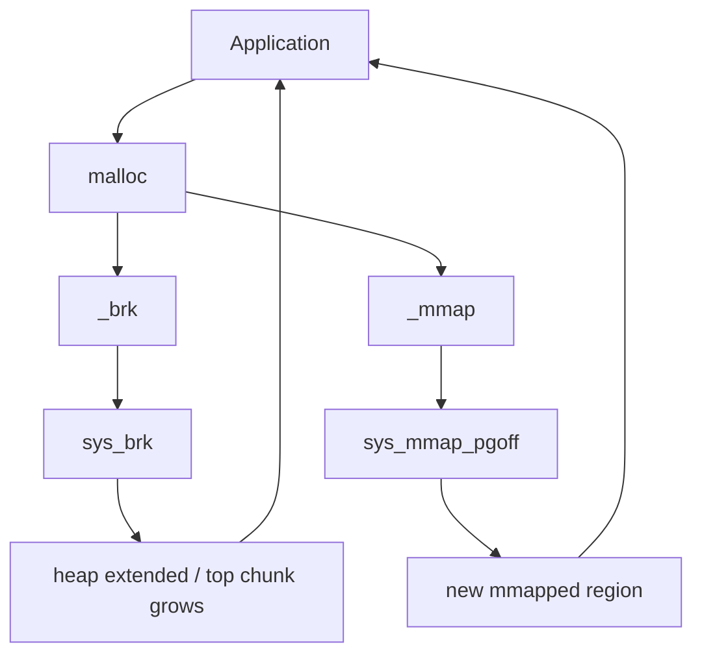

## **Introduction**

I finished the **[Linux Heap Exploitation](https://www.udemy.com/course/linux-heap-exploitation-part-1)** course on Udemy and it was excellent. I highly recommend you try the course if you want hands-on, practical experience in allocator internals and real exploit development — it really clarified the concepts for me. This blog collects the notes, diagrams, and proof-of-concepts I prepared while working through the labs.

## **What is a Heap?**

The heap is a region of memory used for dynamic memory allocation. It is mapped into memory once the first allocation is made by the program through a call to `malloc()`, and can be extended when the program consumes all the memory it can serve. Memory allocations can then be de-allocated with a call to `free()`, giving back the memory to the allocator so it can reuse it for further operations. Unlike the stack, which is managed automatically, the heap requires manual management using functions like `malloc`, `free`, `calloc`, and `realloc`.

When you call `malloc(size)`, the allocator finds a block of memory of the requested size and returns a pointer to it. When you call `free(ptr)`, the memory is marked as free and can be reused.

**Chunk**: The basic unit of memory allocation in the heap. Each chunk contains metadata and user data.

**Metadata**: Information about the chunk, such as its size and whether the previous chunk is free.

**Arena**: A structure that manages a collection of chunks. There can be multiple arenas in a process.


- **`malloc(size_t size)`**: Allocates a chunk of memory of at least `size` bytes.
- **`free(void *ptr)`**: Deallocates a previously allocated chunk and returns it to the heap for reuse.

##### **Heap Management Structures**

- The heap is managed via **`malloc_state` (main_arena)**.  
- **Arenas**: Threads may have their own arena to reduce contention (multi-threading). **arenas** are a critical concept in `glibc`'s `ptmalloc` allocator.
- **`sbrk`/`mmap`**: Small allocations use `sbrk`, while large allocations use `mmap`.

An **arena** is a **memory region** that `glibc` malloc uses to manage allocations. Think of it like a **private heap manager** responsible for handling malloc/free operations for a thread or process.

### Why Do Arenas Exist?

- To avoid **global locking** when multiple threads use `malloc`.
- Each thread can use **its own arena**, improving performance in multithreaded applications.

An arena contains:

- **Bins**: fastbins, smallbins, largebins, unsorted bin
- **tcache**: Thread cache (since glibc 2.26)
- **top chunk**: The remaining free space in the arena    
- **heap_info** and **malloc_state** structures

```c
struct malloc_state {
    mchunkptr fastbinsY[NFASTBINS];
    mchunkptr top;
    mchunkptr last_remainder;
    mchunkptr bins[NBINS * 2];
    ...
};
```

The **`main_arena`** is the **primary `malloc_state`** structure used by `ptmalloc` (glibc’s heap allocator) to manage heap allocations **in the main thread**.

In multithreaded programs, **each thread can have its own arena**, but in single-threaded programs (like most CTF binaries), **everything goes through `main_arena`**.

A `malloc_chunk` is a **metadata structure** that sits **just before** the user data in every heap allocation. It stores information like the chunk's **size**, **status**, and **links** to other chunks.

Think of it like:

```txt
+-----------------------------+
| malloc_chunk metadata       |  ← chunk header
+-----------------------------+
| User data                   |  ← malloc() returns pointer here
+-----------------------------+
```

Here's a simplified version (actual structure is internal and varies with glibc version):

```c
struct malloc_chunk {
    size_t prev_size;    // Size of previous chunk (if free)
    size_t size;         // Size of this chunk + flags (in lower bits)

    struct malloc_chunk* fd;  // Forward pointer (if free)
    struct malloc_chunk* bk;  // Backward pointer (if free)

    // Used in large bins
    struct malloc_chunk* fd_nextsize;
    struct malloc_chunk* bk_nextsize;
};
```

The `size` field includes **two flag bits**:

| Bit | Flag             | Meaning                          |
| --- | ---------------- | -------------------------------- |
| 0   | `PREV_INUSE`     | If set, previous chunk is in-use |
| 1   | `IS_MMAPPED`     | If set, chunk is from `mmap()`   |
| 2   | `NON_MAIN_ARENA` | Used by threaded malloc arenas   |

There are three different types of chunks:
- Allocated chunks
- Free chunks
- The top chunk (or wilderness)

All chunks consist of a header of **0x10** bytes and a body of varying size. The combined length of a chunk's header and body should be aligned on **0x10** bytes (on 64-bit platforms). The header of a chunk looks like this:


*Source*

[quarkslab](https://blog.quarkslab.com/heap-exploitation-glibc-internals-and-nifty-tricks.html)


The three least significant bits of the `size` field (`A|M|P`) in the header hold some useful information for the allocator but we will omit these details.

When it is born, the heap of a program contains only the top chunk, and this chunk is split into smaller ones to satisfy allocation requests. This is done in a linear fashion, the first chunk of memory that is requested will precede the second one, and so on. Ideally, we would like to return freed chunks to the wilderness, this is done by increasing the size of the wilderness in its header. This way, upon the next allocation, the top chunk will be split again and a small chunk of it will be returned to the user.

```txt
--------- size <- Chunk 0
|
--------- size <- Chunk 1
|
--------- size <- Top chunk
| 
```

Refer following C code:

```c
#include <stdio.h>
#include <stdlib.h>

int main() {
    // Allocate three chunks of memory
    void *chunk1 = malloc(24); // Allocate 24 bytes
    void *chunk2 = malloc(24); // Allocate another 24 bytes
    void *chunk3 = malloc(24); // Allocate another 24 bytes

    printf("chunk1: %p\n", chunk1);
    printf("chunk2: %p\n", chunk2);
    printf("chunk3: %p\n", chunk3);

    // Free the second chunk
    free(chunk2);

    // Allocate a new chunk (this might reuse the freed chunk2)
    void *chunk4 = malloc(24);
    printf("chunk4: %p\n", chunk4);

    // Free the remaining chunks
    free(chunk1);
    free(chunk3);
    free(chunk4);

    printf("All chunks freed.\n");
    return 0;
}
```

```bash
gcc -ggdb heap_demo.c -o heap_demo
```

Let's debug in GDB (pwndbg):

```shell
pwndbg> break heap_demo.c:6
Breakpoint 1 at 0x1171: file ./heap_demo.c, line 6.
pwndbg> r
pwndbg> next
pwndbg> next
pwndbg> next
pwndbg> vis
0x555555559000	0x0000000000000000	0x0000000000000291	................
...
0x555555559280	0x0000000000000000	0x0000000000000000	................
0x555555559290	0x0000000000000000	0x0000000000000021	........!.......
0x5555555592a0	0x0000000000000000	0x0000000000000000	................
0x5555555592b0	0x0000000000000000	0x0000000000000021	........!.......
0x5555555592c0	0x0000000000000000	0x0000000000000000	................
0x5555555592d0	0x0000000000000000	0x0000000000000021	........!.......
0x5555555592e0	0x0000000000000000	0x0000000000000000	................
0x5555555592f0	0x0000000000000000	0x0000000000020d11	................
pwndbg> heap -v
Allocated chunk | PREV_INUSE
Addr: 0x555555559000
prev_size: 0x00
size: 0x290 (with flag bits: 0x291)
fd: 0x00
bk: 0x00
fd_nextsize: 0x00
bk_nextsize: 0x00

Allocated chunk | PREV_INUSE
Addr: 0x555555559290
prev_size: 0x00
size: 0x20 (with flag bits: 0x21)
fd: 0x00
bk: 0x00
fd_nextsize: 0x00
bk_nextsize: 0x21

Allocated chunk | PREV_INUSE
Addr: 0x5555555592b0
prev_size: 0x00
size: 0x20 (with flag bits: 0x21)
fd: 0x00
bk: 0x00
fd_nextsize: 0x00
bk_nextsize: 0x21

Allocated chunk | PREV_INUSE
Addr: 0x5555555592d0
prev_size: 0x00
size: 0x20 (with flag bits: 0x21)
fd: 0x00
bk: 0x00
fd_nextsize: 0x00
bk_nextsize: 0x20d11

Top chunk | PREV_INUSE
Addr: 0x5555555592f0
prev_size: 0x00
size: 0x20d10 (with flag bits: 0x20d11)
fd: 0x00
bk: 0x00
fd_nextsize: 0x00
bk_nextsize: 0x00
```

You allocated 3 **chunks** but you are seeing 5 **chunks** in `heap` output of pwndbg.

This is due to the way the **glibc memory allocator** manages the heap. 
1. Top Chunk
The top chunk (also called the **wilderness chunk**) is a special chunk that represents the remaining unused memory in the heap. It is used to service future allocation requests when no suitable free chunk is found in the bins.

The Top Chunk is labelled as Top Chunk in `pwndbg`. This is always present at the end of the heap.


2. Initial Heap Allocation
When the program starts, the **heap** is initialized with a **main arena**. The first allocation request triggers the creation of the heap, which includes:
- A **heap header** (metadata for the heap itself).
- The **top chunk** (to handle future allocations).

This is why you see an additional chunk at the beginning of the heap (lowest address in heap).

This is the heap header, which is part of the initial heap setup.

Before diving into heap internals, we should know the definitions of some significant terms that will be used throughout the post:
- `start_brk`: pointer which denotes the beginning of the heap segment.
- `brk`: pointer that denotes the end of the heap segment.
- `end_data`: pointer which sets the end of the data segment.

The system calls `brk()`, `sbrk()` and `mmap()` are used by `malloc` to request memory from the OS.



### **System Calls Used by the Heap Allocator**

The heap allocator primarily uses the following system calls to interact with the operating system:

A. `brk` and `sbrk`
Purpose: Adjust the program break, which is the end of the heap.
How it works:
- The `brk` system call sets the program break to a specific address.
- The `sbrk` system call increments the program break by a specified number of bytes.

When used:
- When the heap needs to grow (e.g., when there is not enough free memory to satisfy an allocation request).
- When the heap needs to shrink (e.g., when a large amount of memory is freed and the allocator decides to return it to the OS).

What it does:
- Moves the program's heap end (the **program break**) forward or backward.

```c
int brk(void *end_data_segment);
void *sbrk(intptr_t increment);
```

Layout:
```txt
[heap start] -----------------------> brk
              ↑ top chunk
```

B. `mmap`
Purpose: Map a region of memory into the process's address space.
How it works:
- `mmap` can allocate large blocks of memory directly from the OS, bypassing the heap.
- The allocated memory is not part of the heap but is managed separately.

When used:
- For **large allocations** (larger than `mmap_threshold`, typically ≥ 128KB).
- For anonymous memory mappings (not backed by a file).
- When the heap is fragmented, and mmap is more efficient than expanding the heap.

What it does:
- Reserves memory pages directly from the kernel using virtual memory.

```c
void *mmap(void *addr, size_t length, int prot, int flags, int fd, off_t offset);
```

`fd = -1`, `flags = MAP_ANONYMOUS | MAP_PRIVATE`

C. `munmap`
Purpose: Unmap a region of memory previously allocated with `mmap`.

How it works:
- Releases memory back to the OS.
When used:
- When a large block of memory allocated with `mmap` is freed.

Here’s a step-by-step breakdown of how the heap allocator works:

A. Initialization

  - When a program starts, the heap is initialized with a small region of memory.
  - The main arena is created to manage the heap.
  - The top chunk (wilderness chunk) is set up to handle future allocations.

B. Allocation (malloc)

When `malloc(size)` is called:

Check Fastbins:
- If the requested size is small (e.g., < 64 bytes), the allocator checks the **fastbins** (a set of singly linked lists for small chunks).
- If a suitable chunk is found, it is returned to the program.

Check Small Bins:
- If the requested size is larger, the allocator checks the **small bins** (doubly linked lists for slightly larger chunks).
- If a suitable chunk is found, it is returned to the program.

Check Unsorted Bin:
- The allocator checks the **unsorted bin**, which holds recently freed chunks.
- If a suitable chunk is found, it is either returned to the program or moved to the appropriate bin.

Check Large Bins:
- For larger allocations, the allocator checks the **large bins** (sorted by size).
- If a suitable chunk is found, it is returned to the program.

Split Top Chunk:
- If no suitable chunk is found in the bins, the allocator splits the **top chunk** to satisfy the request.
- The top chunk is the remaining memory in the heap.

Request Memory from OS:
- If the top chunk is too small, the allocator uses `brk` or `sbrk` to expand the heap.
- For very large allocations, the allocator uses `mmap` to allocate memory directly from the OS.

C. Freeing (`free`)

When `free(ptr)` is called:
- Check if Chunk is Mapped:
	- If the chunk was allocated with `mmap`, the allocator uses `munmap` to release it.

- Coalesce Free Chunks:
	- The allocator checks if the adjacent chunks are free and merges them to form a larger free chunk (coalescing).

- Add to Bins:
	- The freed chunk is added to the appropriate bin (fastbin, small bin, unsorted bin, etc.).

- Shrink Heap:
	- If a large amount of memory is freed, the allocator may use `brk` to shrink the heap and return memory to the OS.


The **wilderness chunk**, also known as the top chunk, is a special chunk in the heap that represents the remaining unused memory in the heap. It is the last chunk in the heap's memory region and is used to service future allocation requests when no suitable free chunk is found in the bins (e.g., fastbins, small bins, unsorted bins).

The problem is, what happens when there are two consecutive chunks in use and only the first one (Chunk 0) is freed? Then we can't simply return it to the wilderness because it isn't adjacent to it so we need another mechanism to mark it as free and **reusable** (otherwise what's the point of freeing chunks).

This is where the freelists come in. In GLIBC, they're called bins, they exist in five different flavors and are used for different purposes:

1. Fast bins

Singly linked lists to store small chunks (<88 bytes) that are going to be reused soon. There are 10 fast bins that each store chunks of one size so they are always sorted.

2. tcache bins

Another optimization on top of the fastbins. They act exactly like the fastbins but are local to each thread (performing actions on other bins requires acquiring a mutex) so they are much faster to use. There are 64 tcache bins that each hold a maximum of 7 free chunks of size 24 to 1032 bytes.

3. Small bins

Doubly linked lists that store chunks up to 1024 bytes. There are 62 small bins, each holding chunks of a specific size so they remain sorted at all times.

4.  Unsorted bin

Another doubly linked list that is used as a cache layer. Chunks that don't fit into the tcache or fastbins get stored here when they are freed and are put into the appropriate (small/large) bins later. 

5. Large bins

Doubly linked lists to store chunks of size greater than 1024. There are 63 large bins and each bin holds chunks in a certain size range so they have to be kept sorted for fast access/retrieval.

When a chunk is freed and cannot be placed back into the top chunk, it is placed in one of the bins and waits to be allocated again. The allocator will prioritize allocating chunks from the bins instead of the top chunk to reuse memory as often as possible.

Almost all of the heap exploitation techniques rely on one thing: messing with these free lists. This is possible because, for optimization reasons, the developers of malloc decided to store the pointers to the next and previous chunks in free lists inside the chunks themselves. 

Let us see what a free chunk's header and contents look like.


*Source*

[quarkslab](https://blog.quarkslab.com/heap-exploitation-glibc-internals-and-nifty-tricks.html)


We can see that the "user data" of a chunk is reused once it is freed. When a chunk is freed and put into a bin, the allocator links it together with other chunks in the bin and fills in these fwd and bck pointer fields. The lists are traversed by first reading the address of the head of the list (this is a variable in the libc's data section), then reading the contents of each chunk in the bin to get a pointer to the next chunk.

So, if a user can modify the contents of a chunk after it has been freed, they can mess with the forward and backwards pointers of a node in one of the bins. This is what we call a Use After Free vulnerability. Now that we understand how GLIBC's memory allocator allocates and frees chunks, we can start talking about how to abuse it.


## Heap exploitation primitives

Vulnerabilities in programs lead to these three classes of exploitation primitives that can be leveraged in different ways.

**Heap overflow**

This is a simple case of overflowing a buffer. An attacker with this primitive can modify the headers or contents of subsequent chunks or modify the bin list pointers of subsequent **free** chunks.

**Use After Free**

This primitive happens when the developer of a program keeps a reference to a chunk that has been freed. If the attacker can still read the contents of a chunk after it has been freed, they can leak important information such as heap addresses or even an address inside of libc. If the attacker can write into the chunk, they can also modify the bin list pointers. A good example of a leak that can be performed using a UAF vulnerability is leaking a libc address from a doubly linked bin. The unsorted bin is a doubly linked list, but where is the list head stored? In libc! If an attacker manages to get a chunk in the unsorted bin and can use a UAF to read its contents, they are able to read the forward and backward pointers of this unsorted chunk. If this chunk is the first element in the unsorted bin, its backward pointer is effectively a pointer to a libc address, at a known offset! Once the attacker leaked this value, they can calculate the base address of libc, thus breaking ASLR. This is a very useful trick as it's quite easy to get code execution once you know the base address of libc.

**Double-free**

This one is a bit harder to understand. It is a variant of the UAF primitive where an attacker can perform the free operation twice on a chunk. This is a powerful primitive that has been mitigated over time but is still possible to use. The idea is that if you free a chunk twice, it will be present two times in a bin. On a subsequent allocation, you will get a pointer to this chunk and it will be considered both in use and free. If you modify the contents of the chunk at this point, you also modify the bin list pointers of the chunk.

**Why modify bin list pointers?**

The goal is often to craft fake chunks. If you can modify the forwards and backward pointers in a free chunk, you essentially control the location of the next allocation. This gives you a write-what-where, or arbitrary write primitive. Depending on the program, you can also sometimes turn it into an arbitrary read primitive. With these primitives and the possibility of leaking a libc address, it is possible to hijack the program's control flow and gain code execution.

**How to gain code execution?**

There are many ways to gain code execution from heap exploitation primitives but I will only explain the easiest one, in my opinion, using malloc hooks (this only works on GLIBC <= 2.33). GLIBC's malloc implementation provides different API calls to the user. The most common ones are `malloc()`, `free()`, `realloc()`, `calloc()` but they all come with their hook counterparts. A hook is a location in libc's data section that is initially full of 0s that the user of a program can overwrite to execute code before the regular API calls are processed. It is a debug feature that has since been moved to another library because it is such a good exploitation vector. This can, of course, be leveraged by an attacker to gain arbitrary code execution. If the attacker can leak the address of libc and has an arbitrary write primitive, they can write the address of another function in one of the hooks and execute it when the hook is called. The easiest way to get a shell this way is to write the address of the `system()` function of the libc at the address of the `__free_hook`. The `system()` function takes one argument, a pointer to a string, and when the `__free_hook` is executed, the argument to `free()` will be passed to `system()`. If you can allocate a chunk and place the string `/bin/sh` in it, calling `free` on that chunk will effectively call `system("/bin/sh")` and you will get a shell.


**Malloc Hooks**

Malloc hooks are special function pointers in the GNU C Library (glibc) that allow developers to intercept calls to memory allocation functions such as malloc, free, and realloc. These hooks can be used for various purposes, including debugging memory usage, tracking allocations, and implementing custom memory management strategies. The primary hook variable is `__malloc_hook`, which points to a function that is executed whenever malloc is called. Other related hooks include `__free_hook` and `__realloc_hook` for their respective functions.

A typical pseudo code implementation of a malloc hook might look like this:

```c
#include <malloc.h>
#include <stdio.h>

void *my_malloc_hook(size_t size, const void *caller) {
    void *result;
    // Call the original malloc function
    result = malloc(size);
    printf("malloc(%zu) called from %p returns %p\n", size, caller, result);
    return result;
}

void setup_hooks() {
    __malloc_hook = my_malloc_hook;  // Set our custom hook
}

```

An attacker can overwrite the `__malloc_hook` pointer with the address of a malicious function (e.g., one that executes shell commands). This is often done by carefully crafting heap allocations to place data at specific memory locations.
Once the hook is overwritten, subsequent calls to malloc will invoke the attacker's function instead of the original one. This allows for arbitrary code execution during memory allocation processes.

If you remember, earlier we covered **[Hijacking the `puts` Function in C](https://nyxfault.github.io/posts/hijacking_puts/)**— that was another example of redirecting execution, where we intercepted calls to `puts` and sent them to our own code. 
