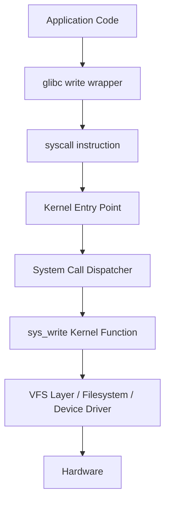
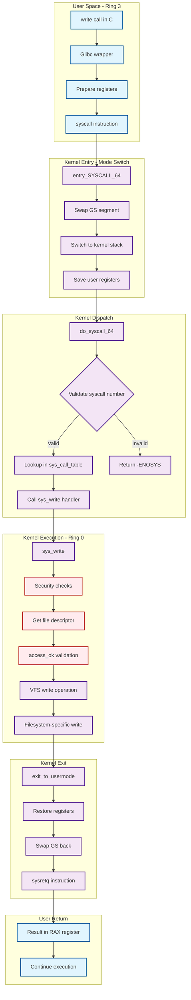

Now that we understand how shellcode gets executed, let's explore what it actually _does_. Most meaningful shellcode needs to interact with the operating system - to open files, create network connections, or spawn shells. This is where **system calls** come in.

### What Are System Calls?

Think of system calls as **privileged operations** that only the operating system kernel can perform. Your user-space programs can't directly:

- Allocate memory
- Access hardware
- Create processes
- Open network sockets

Instead, you ask the kernel to do these tasks for you through system calls. They're the **gateway between user space and kernel space**.

For more in depth knowledge you can refer this [link](https://blog.codingconfessions.com/p/what-makes-system-calls-expensive).

Let me give you an analogy.

Imagine you visit a restaurant:

- **Menu (User Space)**: You can see what’s available and decide what you want.
- **Waiter (System Calls)**: You tell the waiter your order — they’re the only way to reach the kitchen.
- **Chef (Kernel Space):** The chef prepares the food using sharp tools and hot stoves — powerful but restricted to the kitchen.

You can't just walk into the kitchen and cook - you ask the waiter (make a system call) who brings your request to the chefs (kernel).

**Here's the crucial part:** Every time you call the waiter, there's a delay:

1. You have to get their attention
2. They walk to the kitchen
3. They communicate your order
4. They wait for preparation
5. They bring the food back to you

This back-and-forth takes time! Similarly, system calls involve a **context switch** from user mode to kernel mode, which creates measurable overhead but necessary for privileged operations.

## Internal working of Syscall

The `syscall` instruction is a **special CPU instruction** that:

- Switches from **user mode** (ring 3) to **kernel mode** (ring 0)
- Saves the return address in **RCX**
- Saves RFLAGS in **R11**
- Jumps to the address specified in the **IA32_LSTAR** MSR (Model Specific Register)

```txt
; What the CPU does internally during SYSCALL:
save_return_address:    mov rcx, rip
save_flags:             mov r11, rflags
switch_to_kernel_mode:  mov cs, kernel_cs_segment
jump_to_handler:        jmp [IA32_LSTAR]  ; Syscall entry point
```

When entering the Kernel the `IA32_LSTAR` MSR points to the kernel's system call entry point. On Linux, this is typically **[entry_SYSCALL_64](https://elixir.bootlin.com/linux/v4.5/source/arch/x86/entry/entry_64.S#L131)**:

The kernel now needs to route your request to the correct handler:

Refer [this](https://elixir.bootlin.com/linux/v4.7/source/arch/x86/entry/common.c#L333)

Simplified form of above code:

```c
// arch/x86/entry/common.c

__visible void do_syscall_64(struct pt_regs *regs)
{
    unsigned long nr = regs->ax;  // Syscall number from RAX
    
    // 1. Bound check the syscall number
    if (nr >= __NR_syscall_max)
        return -ENOSYS;
    
    // 2. Get the syscall function pointer
    void *syscall_fn = sys_call_table[nr];
    
    // 3. Invoke the actual syscall handler
    regs->ax = syscall_fn(regs->di,   // param 1 from RDI
                         regs->si,    // param 2 from RSI  
                         regs->dx,    // param 3 from RDX
                         regs->r10,   // param 4 from R10
                         regs->r8,    // param 5 from R8
                         regs->r9);   // param 6 from R9
}
```

### Linux x86-64 System Call Mechanism

On modern Linux x64 systems, system calls use the following protocol:

1. **System Call Number** → stored in `rax`
2. **Arguments** → stored in `rdi`, `rsi`, `rdx`, `r10`, `r8`, `r9`
3. **Execute** → `syscall` instruction
4. **Return Value** → comes back in `rax`

Here are the system calls you'll encounter most often in shellcode:

|Syscall|Number|Purpose|Use in Shellcode|
|---|---|---|---|
|`execve`|59|Execute program|Spawn shells|
|`socket`|41|Create socket|Network connections|
|`connect`|42|Connect socket|Reverse shells|
|`bind`|49|Bind socket|Bind shells|
|`listen`|50|Listen for connections|Bind shells|
|`dup2`|33|Duplicate file descriptor|Redirect stdin/stdout/stderr|
|`read`|0|Read from file descriptor|Receive data|
|`write`|1|Write to file descriptor|Send data|
|`open`|2|Open file|File operations|
|`exit`|60|Terminate process|Clean exit|

Let's trace how a simple `exit()` call in C translates down to raw system calls. We'll use the "disassembly approach" to see exactly what happens at each level.

```c
#include <stdlib.h>

int main() {
    exit(42);  // Exit with status code 42
}
```

```bash
$ gcc -o exit_demo exit_demo.c
$ objdump -M intel -d exit_demo 
```

But I want to dump the disassembly of `main` function only. I'll use some Bash-Fu.

```bash
$ objdump -M intel -d exit_demo | awk -F"\\n" -v RS="\\n\\n" '$1 ~ /main/'
0000000000001149 <main>:
    1149:	f3 0f 1e fa          	endbr64 
    114d:	55                   	push   rbp
    114e:	48 89 e5             	mov    rbp,rsp
    1151:	bf 2a 00 00 00       	mov    edi,0x2a
    1156:	e8 f5 fe ff ff       	call   1050 <exit@plt>

```

Notice that we're calling `exit@plt` - this is the **Procedure Linkage Table** entry for the glibc `exit` function.

The glibc `exit` function does much more than just make a system call. But you can notice that we are passing `0x2a` which is `42` in decimal into **rdi** register before calling `exit@plt` and if you remember we have already discussed that arguments to a function in x64 architecture are stored in `rdi`, `rsi`, `rdx`, etc.

Now let's write a version that makes the system call directly, like shellcode would:

```c
#include <unistd.h>
#include <sys/syscall.h>

int main() {
    // Direct system call - no glibc cleanup!
    syscall(SYS_exit, 42);
    
    // This line never executes
    return 0;
}
```

On Linux, the `syscall()` function allows direct invocation of system calls, and their numbers are typically defined in headers like `<sys/syscall.h>` or `<unistd.h>`.

Let's examine the disassembly of our syscall example:

```bash
$ objdump -M intel -d exit | awk -F"\\n" -v RS="\\n\\n" '$1 ~ /main/'
0000000000001149 <main>:
    1149:	f3 0f 1e fa          	endbr64 
    114d:	55                   	push   rbp
    114e:	48 89 e5             	mov    rbp,rsp
    1151:	be 2a 00 00 00       	mov    esi,0x2a
    1156:	bf 3c 00 00 00       	mov    edi,0x3c
    115b:	b8 00 00 00 00       	mov    eax,0x0
    1160:	e8 eb fe ff ff       	call   1050 <syscall@plt>
    1165:	b8 00 00 00 00       	mov    eax,0x0
    116a:	5d                   	pop    rbp
    116b:	c3                   	ret   
```

Breaking down the key instructions:

- `mov esi,0x2a` → **42** (our exit status) in ESI register
- `mov edi,0x3c` → **60** (syscall number for `exit`) in EDI register
- `mov eax,0x0` → **0** in EAX (syscall number for `syscall` itself)
- `call syscall@plt` → Invoke the syscall wrapper


Wait, that seems confusing! Why are we putting 60 in EDI instead of EAX? Let me clarify...

Syscall numbers are essentially **indexes into the kernel's system call table**. Each system call has a unique number that identifies it to the kernel.

System call numbers are architecture-specific. For Linux x86-64, you can find them in:

```bash
# On your system
grep __NR_execve /usr/include/x86_64-linux-gnu/asm/unistd_64.h

# Or check online references
```

For getting list of Linux syscall numbers and calling convention I've developed a command line tool **[syscall_fetch](https://github.com/nyxFault/syscall_fetch)** which basically invoke web api to [syscall.sh](https://syscall.sh/).

For system call documentation, you'll want section 2 of the manual pages.

```bash
# View the system call documentation
# man 2 [syscall]
man 2 exit
```

You'll find synopsis -

```c
#include <unistd.h>
void _exit(int status);
```

This tells you exactly how to call the function in C.

Under that you will find description which explains what the syscall does, edge cases, and special considerations.


Let's trace exactly what happens when we use the `write` system call, from the C library wrapper all the way down to the kernel implementation.

**The Layers of a Write Operation**




When you call `write()` in C, you're actually using a glibc wrapper:

```c
// Your application code
write(1, "Hello", 5);

// Inside glibc (simplified):
ssize_t write(int fd, const void *buf, size_t count) {
    return syscall(SYS_write, fd, buf, count);
}
```

The `write()` you use in C is **not** the actual system call - it's a glibc function that eventually makes the real system call.

Glibc prepares the registers and executes the `syscall` instruction:

```txt
; What glibc's syscall() wrapper generates:
mov    rax, 1          ; SYS_write = 1
mov    rdi, 1          ; fd = stdout  
mov    rsi, buf        ; pointer to "Hello"
mov    rdx, 5          ; count = 5
syscall                ; switch to kernel mode
```

The `syscall` instruction triggers the transition to kernel mode:

1. **CPU switches** from user mode (ring 3) to kernel mode (ring 0)
2. **Execution jumps** to the kernel's system call entry point
3. **Kernel saves** all user registers on its stack
4. **Kernel validates** the system call number and parameters

The kernel looks up the system call number in its dispatch table:

```c
// Simplified system call dispatch
void *sys_call_table[] = {
    [0] = sys_read,     // __NR_read = 0
    [1] = sys_write,    // __NR_write = 1  
    [2] = sys_open,     // __NR_open = 2
    // ... hundreds more
};

// Dispatch logic:
if (syscall_number < NR_syscalls) {
    result = sys_call_table[syscall_number](arg1, arg2, arg3);
}
```

System calls are defined in `arch/x86/entry/syscalls/syscall_64.tbl`. This is a table mapping syscall numbers to function names (like `sys_write`). At compile time, the kernel generates the actual dispatch code in assembly (entry code) that acts like `sys_call_table`.

Refer [this](https://elixir.bootlin.com/linux/v6.17.3/source/arch/x86/entry/syscall_64.c#L29)


For `write`, the kernel calls `sys_write` with the arguments from your program.

Here's what the kernel's `sys_write` function does (simplified from the actual Linux source):

```c
// fs/read_write.c - Linux kernel source
SYSCALL_DEFINE3(write, unsigned int, fd, const char __user *, buf, 
                size_t, count)
{
    struct fd f = fdget_pos(fd);  // 1. Get file descriptor
    
    if (!f.file)
        return -EBADF;           // Invalid file descriptor
    
    // 2. Security and validity checks
    if (!access_ok(buf, count))  
        return -EFAULT;          // Bad user buffer
    
    // 3. Perform the actual write operation
    ret = vfs_write(f.file, buf, count, &pos);
    
    fdput_pos(f);               // 4. Cleanup
    return ret;
}
```

For Older Kernel refer [this](https://elixir.bootlin.com/linux/v4.12.14/source/fs/read_write.c#L597).

In Modern system `sys_write` calls `ksys_write`. Refer [this](https://elixir.bootlin.com/linux/v6.17.3/source/fs/read_write.c#L746) for Modern Kernel.

The kernel's write operation goes through multiple abstraction layers and you can go deeper into it by following the code.
`sys_write` calls `vfs_write` and then `vfs_write` calls `__vfs_write` and so on.


Depending on the file descriptor, the write goes to:

- **Terminal/console** (if fd = 1, stdout)    
- **Regular file** on disk
- **Network socket**
- **Pipe or other special file**

After the write operation completes:

1. **Kernel prepares** return value in RAX register
2. **Kernel restores** all saved user registers
3. **CPU switches** back to user mode via `sysret` instruction
4. **Execution resumes** in your program after the `syscall` instruction


### The Complete Journey Visualized

```txt
User Space              Kernel Space
---------              ------------
                       ┌─────────────────┐
write() call  ────────>│ entry_SYSCALL_64│
                       │   swapgs        │
                       │   save regs     │
mov rax, 1   ────────> │   stack switch  │
syscall      ────────> │                 │
                       ├─────────────────┤
                       │ do_syscall_64() │
                       │   validate nr   │
                       │   lookup table  │
                       │   call handler  │
                       ├─────────────────┤
                       │ sys_write()     │
                       │   check perms   │
                       │   vfs_write()   │
                       │   return result │
                       ├─────────────────┤
                       │ exit_to_usermode│
                       │   restore regs  │
                       │   swapgs        │
Result in RAX <─────── │   sysretq       │
                       └─────────────────┘
```


