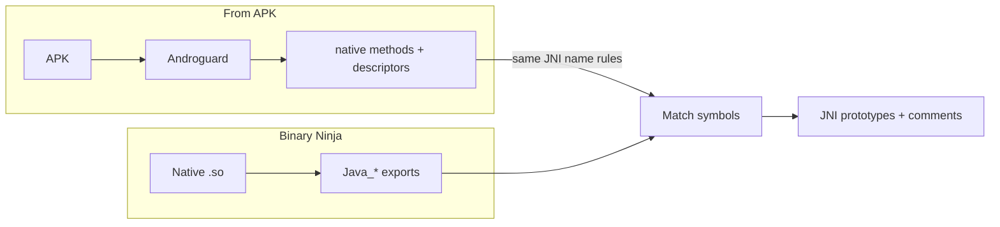

When you open an Android `.so` in a disassembler, JNI entry points show up as long, mangled symbols: `Java_com_example_app_MainActivity_stringFromJNI`. The *real* story lives in the DEX: class name, method name, Java parameter types, and whether the method is `static`. Without that link, you are guessing argument types and renaming by hand.

**JNIAtlas** is a Binary Ninja plugin that closes that gap. It is inspired by classic JNI tooling, especially [Ayrx’s JNIAnalyzer](https://github.com/Ayrx/binja-JNIAnalyzer) for Binary Ninja and the broader Ghidra JNIAnalyzer lineage, but tailored for a smooth “APK in, prototypes on symbols” workflow, plus a small graph to see where each JNI export goes.

The **Import APK** path, in one picture:

If you’d like to learn more about JNI, check out my blog post [here](https://nyxfault.github.io/posts/Android-JNI/), where I go into more detail.

---

## What it does

### 1. Import APK (rename JNI methods)

Pick an APK that matches the native library you have open. JNIAtlas uses **Androguard** to read DEX, finds `native` methods, and matches them to exported `Java_…` functions by the standard JNI name-mangling rules.

For each match it applies a **C-style JNI prototype**: `JNIEnv*`, `jobject` or `jclass`, and parameters like `jstring`, `jbyteArray`, `jint`, and so on, aligned with what the Java side declares.

It also drops a short comment on the function (class and method name) and can tag functions so you can filter or search later.

### 2. JNI Radar (graph + log)

Without an APK, or when you just want orientation: **JNI Radar** scans the current binary for JNI-shaped exports (`Java_…`, `JNI_OnLoad`, `JNI_OnUnload`), lists them in the Log, and opens a **flow graph**: root → each JNI entry → its callees (deduplicated). Useful for spotting helper routines and JNI boilerplate at a glance.

---

## Why not only a type library?

Community JNI type libraries are great for *types*, but Binary Ninja’s parser and incomplete or mismatched typelibs can disagree on things like `JNINativeInterface_` or opaque JNI handles. JNIAtlas **registers a compact, self-contained JNI typedef set** in the BinaryView (in a few parsed batches, then committed so each stage sees the previous typedefs), so prototypes resolve reliably even when a stock JNI typelib misbehaves on a given `.so`.

You can still add optional Ayrx-style `jni.bntl` collections for extra comfort; the plugin does not require them for the core rename flow.

---

## Dependencies

- **Binary Ninja** (Python 3 API).
- **Androguard** (from PyPI or the upstream git tree JNIAtlas recommends) for **Import APK** only.
- A matching **APK** (or at least its DEX) when you want APK-driven typing.

Install the plugin under Binary Ninja’s plugin path, ensure Androguard is importable from the same Python Binary Ninja uses, and reload plugins.

---

## Demo: HelloJNI

For this walkthrough I use **[HelloJNI](https://github.com/nyxFault/HelloJNI)**, a small public demo app I created. It is having multi-ABI `libhello-jni.so` crackme style native library. The repo has **[GitHub Releases](https://github.com/nyxFault/HelloJNI/releases)** with packaged APKs so you can follow along without building. You can also clone the project and run `./gradlew assembleDebug` if you prefer a local APK (for example `app/build/outputs/apk/debug/app-debug.apk`).

**Steps:**

1. Download an APK from **[Releases](https://github.com/nyxFault/HelloJNI/releases)** or build one from the repo as above.
2. Extract or locate the **`.so`** for the ABI you care about (e.g. `arm64-v8a`) and open it in Binary Ninja.
3. Run **`JNIAtlas → Import APK (rename JNI methods)`** and select the APK.
4. Find your `Java_…` export: it should now show a proper JNI signature: `JNIEnv* env`, `jobject` or `jclass` for `thiz`, and typed parameters, instead of generic pointers.
5. Optionally run **`JNIAtlas → JNI Radar`** to see the JNI exports and callees in a graph and in the Log.

The exact class and method names depend on your Java/Kotlin code; the plugin’s comments reflect whatever Androguard reads from the DEX.

---

## When to use it

- Triaging **JNI-heavy** `.so` files from Android malware or apps.
- Teaching or documenting how **Java declarations** map to **native entry points**.
- Speeding up analysis before you dive into HLIL or attach a debugger.

---

## Limitations (honest scope)

- Matching is by **mangled JNI symbol name**; obfuscated or dynamically registered natives (`RegisterNatives`) need other techniques.
- The APK you pick should **correspond** to the native code you are analyzing (same build or compatible DEX), or names and descriptors will not line up.

---

## Credits and license

This project is heavily inspired by [JNIAnalyzer](https://github.com/Ayrx/JNIAnalyzer). I’d like to thank its author for their excellent work and the ideas that helped shape this project.

I also appreciate the powerful Binary Ninja API, which made this project possible.